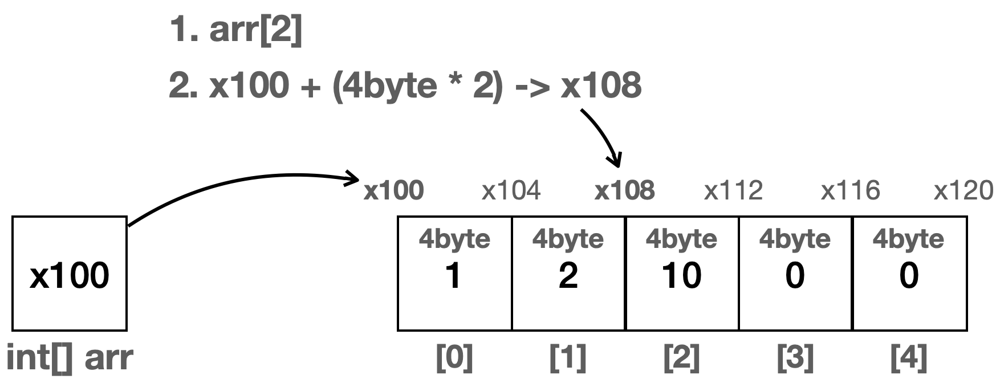
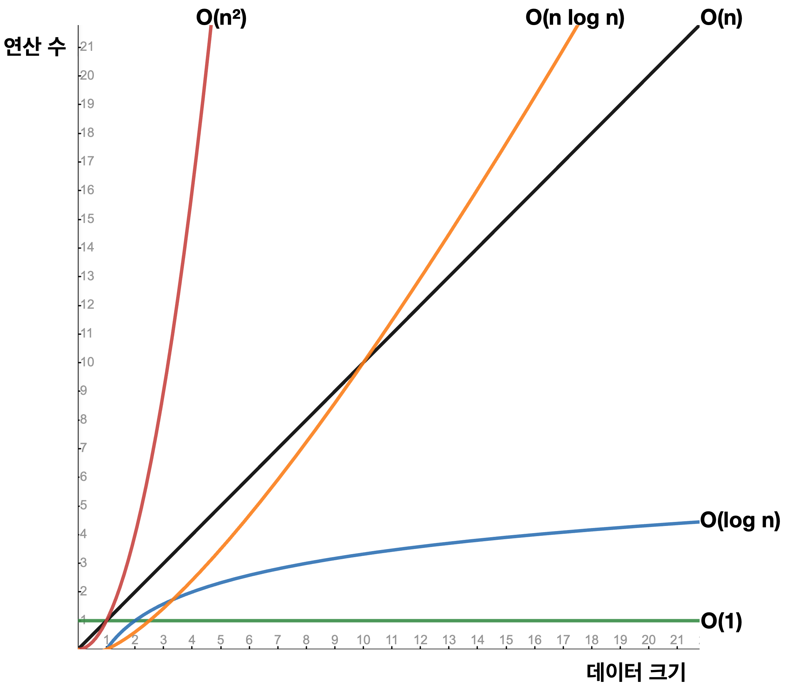

# [ 배열과 인덱스 ]
- 여러 데이터(자료)를 구조화해서 다루는 것을 자료 구조라고 한다.
- 자바는 배열 뿐만 아니라, 컬렉션 프레임 워크라는 이름으로 다양한 자료 구조를 제공한다.
- 먼저 배열에 대해서 알아보자

### 인덱스를 통한 입력, 변경, 조회
- 배열에서 자료를 찾을 때 인덱스를 사용하면 매우 빠르게 자료를 찾을 수 있다.
- 인덱스를 통한 입력, 변경, 조회의 경우 한번의 계산으로 자료의 위치를 찾을 수 있다.
- 배열을 생성하면 메모리 힙 영역에 순서대로 붙어서 만들어진다.
- 여러개의 상자가 붙어 있는 이미지를 연상하면 된다.
- 따라서 첫번째 박스 즉, 배열의 시작 위치만 알면 해당 위치에  ( 메모리 박스 하나 크기 * 인덱스 ) 를
  더하면 해당 인덱스에 해당하는 값을 바로 찾을 수 있는 것이다.

```java
public class ArrayMain1 {

    public static void main(String[] args) {
        int[] arr = new int[5];
        //index 입력: O(1)
        System.out.println("==index 입력: O(1)==");
        arr[0] = 1;
        arr[1] = 2;
        arr[2] = 3;
        System.out.println(Arrays.toString(arr));

        //index 변경: O(1)
        System.out.println("==index 변경: O(1)==");
        arr[2] = 10;
        System.out.println(Arrays.toString(arr));

        //index 조회: O(1)
        System.out.println("==index 조회: O(1)==");
        System.out.println("arr[2] = " + arr[2]);

    }
}
```


### 배열의 검색
- 배열에 들어 있는 데이터를 찾는 것을 검색이라고 한다.
- 이때는 데이터를 하나하나 비교해야 한다.
- 이전과 같이 인덱스를 통해서 한번에 찾을 수 없다.
- 따라서 배열의 크기가 크면 클 수록 오랜 시간이 걸리기 때문에
배열의 크기가 n이면 n번의 연산이 필요하다.
```java
    public static void main(String[] args) {
    int[] arr = new int[5];
    
    //검색: O(n)
    System.out.println("==배열 검색: O(n)==");
    System.out.println(Arrays.toString(arr));
    int value = 10;
    for (int i = 0; i < arr.length; i++) {
        System.out.println("arr[" + i + "]:" + arr[i]);
        if (arr[i] == value) {
            System.out.println(value + " 찾음");
            break;
        }
    }

}
```
# [ 빅오 표기법 ]

- 빅오 표기법은 매우 큰 데이터를 입력한다고 가정하고, 데이터의 양 증가에 따른
성능의 변화 추세를 비교하는데 사용한다.
- 대략적인 추세를 보는 것이기 때문에 상수를 제거하여 계수가 제거된 최고차항으로 표기한다.
- 또한 최악의 경우를 가정하여 표기한다.
- 빅오 표기법의 예시
  - **O(1)** - 상수 시간: 입력 데이터의 크기에 관계없이 알고리즘의 실행 시간이 일정한다.
  예) 배열에서 인덱스를 사용하는 경우
  - **O(n)** - 선형 시간: 알고리즘의 실행 시간이 입력 데이터의 크기에 비례하여 증가한다.
  예) 배열의 검색, 배열의 모든 요소를 순회하는 경우
  - **O(n²)** - 제곱 시간: 알고리즘의 실행 시간이 입력 데이터의 크기의 제곱에 비례하여 증가한다.
  n²은 `n * n` 을 뜻한다.
  예) 보통 이중 루프를 사용하는 알고리즘에서 나타남
  - **O(log n)** - 로그 시간: 알고리즘의 실행 시간이 데이터 크기의 로그에 비례하여 증가한다.
  예) 이진 탐색
  - **O(n log n)** - 선형 로그 시간:
  예) 많은 효율적인 정렬 알고리즘들



# [ 배열에 데이터 추가 ]

- 배열에 새로운 데이터를 추가할려면 먼저 공간을 확보해야 한다.
- 따라서 경우에 따라서 기존 데이터를 오른쪽으로 한칸씩 밀어내야 한다.
- 단 배열은 기본적으로 초기 지정한 크기를 넘어서 데이터를 추가할 수 없기 때문에 값이 비어 있는 인덱스가 존재할 경우에 
데이터를 추가하는 것을 의미한다.
- 배열에 데이터를 추가하는 경우는 크게 3가지로 구분할 수 있다.
    - 배열의 첫번째 위치에 추가하는 경우
      - 기존 데이터를 모두 오른쪽으로 한칸씩 이동해야 한다
      - 배열의 마지막 부분부터 한칸씩 오른쪽으로 이동하게 된다.
      - 이동 후 확보된 공간에 데이터가 추가된다.
    - 배열의 중간에 추가하는 경우
      - 추가하고자 하는 인덱스부터 시작해서 한칸씩 오른쪽으로 이동하게 된다.
      - 이 경우 인덱스 왼쪽의 데이터는 움직이지 않는다.
      - 이렇게 확보된 공간에 데이터를 추가한다.
    - 배열의 마지막에 추가하는 경우
      - 이 경우는 기존 데이터를 이동하지 않고 바로 값이 추가 된다.

### 배열에 데이터를 추가할 때 위치에 따른 성능 변화

- 배열의 첫번째 위치에 추가
  - 배열의 첫번째 위치를 찾는데는 인덱스를 사용하므로 O(1)이 걸린다.
  모든 데이터를 배열의 크기만큼 한 칸씩 이동해야 한다. 따라서 O(n) 만큼의 연산이 걸린다.
  O(1 + n) O(n)이 된다.
- 배열의 중간 위치에 추가
  - 배열의 위치를 찾는데는 O(1)이 걸린다.
  index의 오른쪽에 있는 데이터를 모두 한 칸씩 이동해야 한다. 따라서 평균 연산은 O(n/2)이 된다.
  O(1 + n/2) O(n)이 된다.
- 배열의 마지막 위치에 추가
  - 이 경우 배열이 이동하지 않고 배열의 길이를 사용하면 마지막 인덱스에 바로 접근할 수 있으므로 한번의 계
  산으로 위치를 찾을 수 있고, 기존 배열을 이동하지 않으므로 O(1)이 된다.

```java
package collection.array;

import java.util.Arrays;

/**
 * 배열의 특징
 */
public class ArrayMain2 {

    public static void main(String[] args) {
        int[] arr = new int[5];
        arr[0] = 1;
        arr[1] = 2;
        System.out.println(Arrays.toString(arr));

        //배열의 첫번째 위치에 추가
        //기본 배열의 데이터를 한 칸씩 뒤로 밀고 배열의 첫번째 위치에 추가
        System.out.println("배열의 첫번째 위치에 3 추가 O(n)");
        int newValue = 3;
        addFirst(arr, newValue);
        System.out.println(Arrays.toString(arr));

        //index 위치에 추가
        //기본 배열의 데이터를 한 칸씩 뒤로 밀고 배열의 index 위치에 추가
        System.out.println("배열의 index(2) 위치에 4 추가 O(n)");
        int index = 2;
        int value = 4;
        addAtIndex(arr, index, value);
        System.out.println(Arrays.toString(arr));

        System.out.println("배열의 마지막 위치에 5 추가 O(1)");
        addLast(arr, 5);
        System.out.println(Arrays.toString(arr));
    }

    private static void addLast(int[] arr, int newValue) {
        arr[arr.length - 1] = newValue;
    }

    private static void addFirst(int[] arr, int newValue) {
        for (int i = arr.length - 1; i > 0; i--) {
            arr[i] = arr[i - 1];
        }
        arr[0] = newValue;
    }

    private static void addAtIndex(int[] arr, int index, int value) {
        for (int i = arr.length - 1; i > index; i--) {
            arr[i] = arr[i - 1];
        }
        arr[index] = value;
    }
}
```

### 배열의 한계
- 배열은 가장 기본적인 자료 구조이고, 특히 인덱스를 활용할 때 최고 효율이 나온다.
- 하지만 생성 시점에 크기를 미리 정해야 하는 단점이 있다.
- 미리 엄청 큰 배열을 선언할 수도 있지만 이렇게 되면 사용하지 않는 메모리 공간을
낭비하게 된다.
- 따라서 언제든 동적으로 크기를 늘리고 줄일 수 있는 자료 구조가 필요한데
그것이 리스트 ( List )다.

# [ ArrayList ( 배열 리스트 )]

- 배열의 불편함을 해소하고 동적으로 데이터를 추가할 수 있는 자료 구조를 
리스트 라고 한다.
- 배열은 순서가 있고 중복을 허용하지만 크기가 정적으로 고정되는 반면 리스트는
순서가 있고 중복을 허용하지만 크기가 동적으로 변할 수 있다.

- 먼저 리스트 자료 구조 중에서 배열을 활용해서 만들어진 ArrayList라는 것이 있는데
이걸 직접 만들어 보자.

### MyArrayList

- ArrayList는 내부적으로 배열을 쓰기 때문에 ArrayList가 제공하는
메서드는 배열에 값을 넣고, 빼고, 찾는 기능들이다.


```java
package collection.array;

import java.util.Arrays;

public class MyArrayListV1 {

    private static final int DEFAULT_CAPACITY = 5;
    
    // 모든 타입을 받기 위해 Object로 배열을 생성한다.
    private Object[] elementData;
    private int size = 0;
    
    // ArrayList는 내부적으로 배열을 사용한다.
    // 파라미터없이 ArrayList를 생성하면 초기 배열의 크기가 5
    public MyArrayListV1() {
        elementData = new Object[DEFAULT_CAPACITY];
    }

    // ArrayList를 만들때 내부적으로 생성되는 배열의 크기를
    // 지정할 수있는 생성자
    public MyArrayListV1(int initialCapacity) {
        elementData = new Object[initialCapacity];
    }

    public int size() {
        return size;
    }
    
    // add를 통해 ArrayList에 값을 넣으면 0번째 인덱스 부터
    // 배열에 값이 들어가고 내부적으로 size를 키워서 다음에 add를 통해 
    // 추가되는 값은 그 다음 index에 값이 들어 간다.
    public void add(Object e) {
        elementData[size] = e;
        size++;
    }
    
    // ArrayList는 내부적으로 배열을 쓰기 때문에 
    // index로 값을 조회한다.
    public Object get(int index) {
        return elementData[index];
    }
    
    // set도 마찬가지로 배열에 값을 넣는 것이기 때문에 
    // 인덱스와 element를 받고 값을 넣을 건데
    // 해당 인덱스에 이미 값이 있다면 기존 값을 리턴
    public Object set(int index, Object element) {
        Object oldValue = get(index);
        elementData[index] = element;
        return oldValue;
    }
    
    // 배열에서 특정 값의 인덱스를 찾는 것
    // 없으면 -1을 반환한다.
    public int indexOf(Object o) {
        for (int i = 0; i < size; i++) {
            if (o.equals(elementData[i])) {
                return i;
            }
        }
        return -1;
    }

    @Override
    public String toString() {
        return Arrays.toString(Arrays.copyOf(elementData, size)) + " size=" + size + ", capacity=" + elementData.length;
    }

}


```
- 위에서 만든 MyArrayList를 사용 해 보자.

```java

package collection.array;

public class MyArrayListV1Main {

    public static void main(String[] args) {
        MyArrayListV1 list = new MyArrayListV1();
        System.out.println("==데이터 추가==");
        System.out.println(list);
        list.add("a");
        System.out.println(list);
        list.add("b");
        System.out.println(list);
        list.add("c");
        System.out.println(list);

        System.out.println("==기능 사용==");
        System.out.println("list.size(): " + list.size());
        System.out.println("list.get(1): " + list.get(1));
        System.out.println("list.indexOf('c'): " + list.indexOf("c"));
        System.out.println("list.set(2, 'z'), oldValue: " + list.set(2, "z"));
        System.out.println(list);

        System.out.println("==범위 초과==");
        list.add("d");
        System.out.println(list);
        list.add("e");
        System.out.println(list);

        //범위 초과, 사이즈가 늘어나지 않으면 예외 발생
        list.add("f");
        System.out.println(list);
    }
}

//실행 결과
==데이터 추가==
        [] size=0, capacity=5
        [a] size=1, capacity=5
        [a, b] size=2, capacity=5
        [a, b, c] size=3, capacity=5
        
==기능 사용==
        list.size(): 3
        list.get(1): b
        list.indexOf('c'): 2
        list.set(2, 'z'), oldValue: c
        [a, b, z] size=3, capacity=5
        
==범위 초과==
        [a, b, z, d] size=4, capacity=5
        [a, b, z, d, e] size=5, capacity=5

// 사이즈가 늘어나지 않아 list.add("f")시 에러 발생
Exception in thread "main" java.lang.ArrayIndexOutOfBoundsException: Index 5
out of bounds for length 5
at collection.array.MyArrayListV1.add(MyArrayListV1.java:25)
at collection.array.MyArrayListV1Main.main(MyArrayListV1Main.java:30)

```

- 위 코드에서 사이즈가 동적으로 늘어나지 않아 에러가 발생했다.
- ArrayList는 크기가 동적으로 변하기 때문에 해당 기능을 추가해 보자.

### MyArrayList2

- MyArrayList에서 리스트의 size가 배열의 크기인 capacity를 
넘어가게 되는 상황이 되면 더 큰 배열을 만들어서 문제를 해결해 보자.

```java

package collection.array;

import java.util.Arrays;

public class MyArrayListV2 {

    private static final int DEFAULT_CAPACITY = 5;

    private Object[] elementData;
    private int size = 0;

    public MyArrayListV2() {
        elementData = new Object[DEFAULT_CAPACITY];
    }

    public MyArrayListV2(int initialCapacity) {
        elementData = new Object[initialCapacity];
    }

    public int size() {
        return size;
    }

    public void add(Object e) {
        // 해당 조건이 만족되면 grow메서드 호출
        if (size == elementData.length) {
            grow();
        }
        elementData[size] = e;
        size++;
    }

    // 초기에 설정된 배열의 크기의 2배로 배열을 만들고
    // 기존의 값을 복사한다.
    // Arrays.copyOf() 메서드는 항상 새로운 배열(New Array) 객체를 생성하여 반환한다.
    // 복사가 되면 이전의 배열은 더이상 참조하지 않게 되어서
    // 가비지 컬렉터의 대상이 되어 삭제 된다.
    private void grow() {
        int oldCapacity = elementData.length;
        int newCapacity = oldCapacity * 2;
        elementData = Arrays.copyOf(elementData, newCapacity);
    }
    
    public Object get(int index) {
        return elementData[index];
    }

    public Object set(int index, Object element) {
        Object oldValue = get(index);
        elementData[index] = element;
        return oldValue;
    }

    public int indexOf(Object o) {
        for (int i = 0; i < size; i++) {
            if (o.equals(elementData[i])) {
                return i;
            }
        }
        return -1;
    }

    @Override
    public String toString() {
        return Arrays.toString(Arrays.copyOf(elementData, size)) + " size=" + size + ", capacity=" + elementData.length;
    }

}

```

- 위 클래스를 사용해 보자.

```java
package collection.array;

public class MyArrayListV2Main {

    public static void main(String[] args) {
        MyArrayListV2 list = new MyArrayListV2(2);
        System.out.println(list);

        list.add("a");
        System.out.println(list);
        list.add("b");
        System.out.println(list);
        list.add("c");
        System.out.println(list);
        list.add("d");
        System.out.println(list);
        list.add("e");
        System.out.println(list);
        list.add("f");
        System.out.println(list);
    }
}


// 출력 결과를 보면 capacity가 계속 늘어나서 
// 배열의 크기가 동적으로 변하는 것처럼 동작한다.
[] size=0, capacity=2
[a] size=1, capacity=2
[a, b] size=2, capacity=2
[a, b, c] size=3, capacity=4
[a, b, c, d] size=4, capacity=4
[a, b, c, d, e] size=5, capacity=8
[a, b, c, d, e, f] size=6, capacity=8
```


### MyArrayList3

- MyArrayList2에서 크기가 동적으로 변하는 것까진 되었고 이제   
특정 index의 위치에 데이터를 추가하거나 삭제하는 것을 구현해 보자.
- 배열은 특정 인덱스를 지정해서 거기에 값을 넣는 것 밖에는 못한다.
따라서 기존에 이미 값이 있었다면 덮어씌여진다.
- ArrayList에서는 add() 메서드를 통해특정 인덱스에 값을 추가 하는데 만약 기존에 값이 
있었다면 배열 처럼 덮어쓰는 것이 아니라 한칸씩 밀어내게 된다.
- 또한 배열은 데이터 삭제 기능이 아얘 없다. 따라서 특정 인덱스의 값을
삭제하고 싶으면 해당 인덱스 다음 인덱스 부터 한칸씩 다 땡겨서 
삭제하고 싶은 값을 덮어쓰는 방법 밖에는 없다. 심지어 이렇게 해도 실제 이동이 아닌 뒤에 인덱스의 값을 
앞의 인덱스 값에 복사하는 것이다. 따라서 마지막 인덱스의 값은 여전히 살아 있고, 마지막 인덱스의 값은
바로 앞 인덱스와 같게 되기 때문에 null같은 값을 넣어줘야 한다.

### MyArrayList3

```java

package collection.array;

import java.util.Arrays;

public class MyArrayListV3 {

    private static final int DEFAULT_CAPACITY = 5;

    private Object[] elementData;
    private int size = 0;

    public MyArrayListV3() {
        elementData = new Object[DEFAULT_CAPACITY];
    }

    public MyArrayListV3(int initialCapacity) {
        elementData = new Object[initialCapacity];
    }

    public int size() {
        return size;
    }

    public void add(Object e) {
        if (size == elementData.length) {
            grow();
        }
        elementData[size] = e;
        size++;
    }

    //코드 추가
    public void add(int index, Object e) {
        if (size == elementData.length) {
            grow();
        }
        shiftRightFrom(index);
        elementData[index] = e;
        size++;
    }

    private void grow() {
        int oldCapacity = elementData.length;
        int newCapacity = oldCapacity * 2;
        elementData = Arrays.copyOf(elementData, newCapacity);
    }

    //코드 추가, 요소의 마지막부터 index까지 오른쪽으로 밀기
    private void shiftRightFrom(int index) {
        for (int i = size; i > index; i--) {
            elementData[i] = elementData[i - 1];
        }
    }

    public Object get(int index) {
        return elementData[index];
    }

    public Object set(int index, Object element) {
        Object oldValue = get(index);
        elementData[index] = element;
        return oldValue;
    }

    //코드 추가
    public Object remove(int index) {
        Object oldValue = get(index);
        shiftLeftFrom(index);

        size--;
        elementData[size] = null;
        return oldValue;
    }

    //코드 추가, 요소의 index부터 마지막까지 왼쪽으로 밀기
    private void shiftLeftFrom(int index) {
        for (int i = index; i < size - 1; i++) {
            elementData[i] = elementData[i + 1];
        }
    }

    public int indexOf(Object o) {
        for (int i = 0; i < size; i++) {
            if (o.equals(elementData[i])) {
                return i;
            }
        }
        return -1;
    }

    @Override
    public String toString() {
        return Arrays.toString(Arrays.copyOf(elementData, size)) + " size=" + size + ", capacity=" + elementData.length;
    }

}

```
- 위 클래스를 사용해 보자.

```java
package collection.array;

public class MyArrayListV3Main {

    public static void main(String[] args) {
        MyArrayListV3 list = new MyArrayListV3();
        //마지막에 추가 //O(1)
        list.add("a");
        list.add("b");
        list.add("c");
        System.out.println(list);

        //원하는 위치에 추가
        System.out.println("addLast");
        list.add(3, "addLast"); //O(1)
        System.out.println(list);

        System.out.println("addFirst");
        list.add(0, "addFirst"); //O(n)
        System.out.println(list);

        //삭제
        Object removed1 = list.remove(4);//remove Last O(1)
        System.out.println("remove(4)="+ removed1);
        System.out.println(list);

        Object removed2 = list.remove(0);//remove First O(n)
        System.out.println("remove(0)=" + removed2);
        System.out.println(list);
    }
}

// 출력 결과

[a, b, c] size=3, capacity=5
addLast
[a, b, c, addLast] size=4, capacity=5
addFirst
[addFirst, a, b, c, addLast] size=5, capacity=5
remove(4)=addLast
[addFirst, a, b, c] size=4, capacity=5
remove(0)=addFirst
[a, b, c] size=3, capacity=5

```

- 위에서 배열에서 없던 add와 remove를 통해 특정 인덱스에 값을 추가하고
삭제 하는 기능이 ArrayList에서는 가능함을 알았다.
- 하지만 치명적인 문제가 있다.
- 아래 코드를 보자

```java

package collection.array;

public class MyArrayListV3BadMain {

    public static void main(String[] args) {
        MyArrayListV3 numberList = new MyArrayListV3();

        // 숫자만 입력 하기를 기대
        numberList.add(1);
        numberList.add(2);
        numberList.add("문자3"); //문자를 입력
        System.out.println(numberList);

        // Object를 반환하므로 다운 캐스팅 필요
        Integer num1 = (Integer) numberList.get(0);
        Integer num2 = (Integer) numberList.get(1);

        // ClassCastException 발생, 문자를 Integer로 캐스팅
        Integer num3 = (Integer) numberList.get(2);
    }
}

// 출력 결과

[1, 2, 문자3] size=3, capacity=5

// ArrayList 내부적으로 사용되는 배열이 Object타입이라서
// 모든 타입이 제한없이 들어 간다.
// 그래서 나중에 사용할 때 캐스팅의 번거로움과
// 타입이 달라질 수 있는 문제가 존재한다.
Exception in thread "main" java.lang.ClassCastException: class java.lang.String cannot be cast to class java.lang.Integer (java.lang.String and java.lang.Integer are in module java.base of loader 'bootstrap')
at collection.array.MyArrayListV3BadMain.main(MyArrayListV3BadMain.java:19)
```

- 위의 문제 때문에 ArrayList는 제네릭을 지원한다.

### MyArrayList4
- 앞서 만든 `MyArrayList` 들은 `Object` 를 입력받기 때문에 아무 데이터나 입력할 수 있고, 또 결과로 `Object` 를 반
  환한다. 
- 따라서 필요한 경우 다운 캐스팅을 해야하고, 또 타입 안전성이 떨어지는 단점이 있다.
- 제네릭을 도입하면 타입 안전성을 확보하면서 이런 문제를 한번에 해결할 수 있다.

```java
package collection.array;

import java.util.Arrays;

public class MyArrayListV4<E> {

    private static final int DEFAULT_CAPACITY = 5;

    private Object[] elementData;
    private int size = 0;

    public MyArrayListV4() {
        elementData = new Object[DEFAULT_CAPACITY];
    }

    public MyArrayListV4(int initialCapacity) {
        elementData = new Object[initialCapacity];
    }

    public int size() {
        return size;
    }

    public void add(E e) {
        if (size == elementData.length) {
            grow();
        }
        elementData[size] = e;
        size++;
    }

    public void add(int index, E e) {
        if (size == elementData.length) {
            grow();
        }
        shiftRightFrom(index);
        elementData[index] = e;
        size++;
    }

    //요소의 마지막부터 index까지 오른쪽으로 밀기
    private void shiftRightFrom(int index) {
        for (int i = size; i > index; i--) {
            elementData[i] = elementData[i - 1];
        }
    }

    @SuppressWarnings("unchecked")
    // 애초에 add메서드에서 지정된 타입의 데이터만 들어오기 때문에
    // 다운캐스팅시에도 아무런 문제가 없다.
    public E get(int index) {
        return (E) elementData[index];
    }

    public E set(int index, E element) {
        E oldValue = get(index);
        elementData[index] = element;
        return oldValue;
    }

    public E remove(int index) {
        E oldValue = get(index);
        shiftLeftFrom(index);

        size--;
        elementData[size] = null;
        return oldValue;
    }

    //요소의 index부터 마지막까지 왼쪽으로 밀기
    private void shiftLeftFrom(int index) {
        for (int i = index; i < size - 1; i++) {
            elementData[i] = elementData[i + 1];
        }
    }

    public int indexOf(E o) {
        for (int i = 0; i < size; i++) {
            if (o.equals(elementData[i])) {
                return i;
            }
        }
        return -1;
    }

    private void grow() {
        int oldCapacity = elementData.length;
        int newCapacity = oldCapacity * 2;
        elementData = Arrays.copyOf(elementData, newCapacity);
    }

    @Override
    public String toString() {
        return Arrays.toString(Arrays.copyOf(elementData, size)) + " size=" + size + ", capacity=" + elementData.length;
    }

}
```

- 위 클래스를 사용해 보자

```java
package collection.array;

public class MyArrayListV4Main {

    public static void main(String[] args) {
        MyArrayListV4<String> stringList = new MyArrayListV4<>();
        stringList.add("a");
        stringList.add("b");
        stringList.add("c");
        String string = stringList.get(0);
        System.out.println("string = " + string);
        
        MyArrayListV4<Integer> intList = new MyArrayListV4<>();
        intList.add(1);
        intList.add(2);
        intList.add(3);
        Integer integer = intList.get(0);
        System.out.println("integer = " + integer);
    }
}


// 실행 결과
string = a
integer = 1
```

- 제네릭을 사용한 덕분에 타입 인자로 지정한 타입으로만 안전하게 데이터를 저장하고, 조회할 수 있게 되었다.
- 제네릭의 도움으로 타입 안전성이 높은 자료 구조를 만들 수 있다.

### 제네릭 ArrayList에서 내부 배열에 Object 타입을 사용하는 이유

- 생성자를 보면 생성시 new 키워드를 통해서 배열을 생성한다.
- 근데 여기서 new E 처럼 타입 매개변수로 배열 생성이 불가능하다.
- 그 이유는 제네릭은 런타임에 이레이저에 의해 타입 정보가 사라지기 때문이다.
```java
// 컴파일 전 (제네릭 코드):
List<String> stringList = new ArrayList<>();
stringList.add("Hello");

// 컴파일 후 (바이트코드, 런타임에 실행되는 형태):
List stringList = new ArrayList();
stringList.add("Hello"); // String이 아닌 Object 타입으로 처리됨
```


### ArrayList의 단점

- 정확한 크기를 미리 알지 못하면 메모리가 낭비된다. 배열을 사용하므로 배열 뒷 부분에 사용되지 않고, 낭비되는
  메모리가 있다.
-   데이터를 중간에 추가하거나 삭제할 때 비효율적이다.
  이 경우 데이터를 한 칸씩 밀어야 한다. 이것은 O(n)으로 성능이 좋지 않다.
  만약 데이터의 크기가 1,000,000건이라면 최악의 경우 데이터를 추가할 때 마다 1,000,000건의 데이터를
  밀어야 한다.
- 배열 리스트는 순서대로 마지막에 데이터를 추가하거나 삭제할 때는 성능이 좋지만, 앞이나 중간에 데이터를 추가하거
  나 삭제할 때는 성능이 좋지 않다. 
- 이러한 단점을 해결한 자료 구조가 LinkedList다.