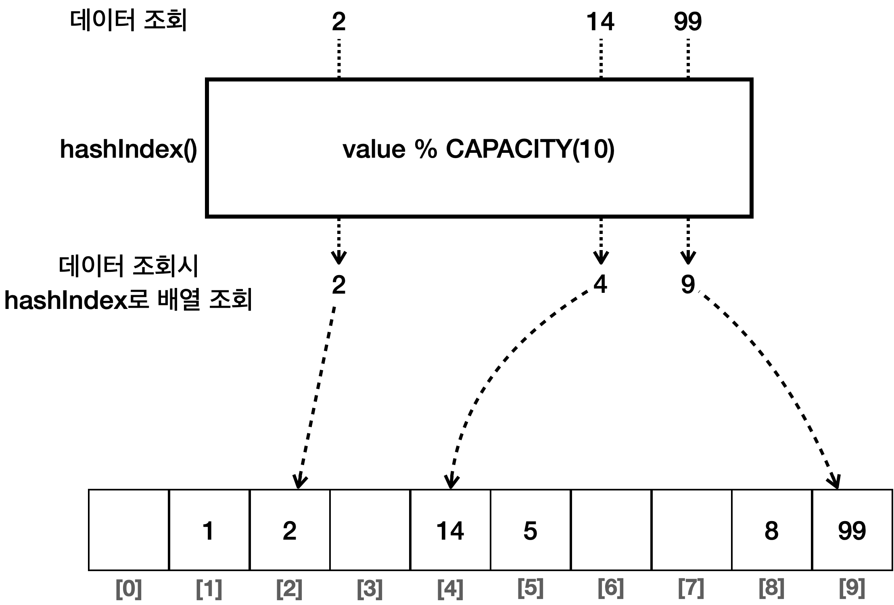
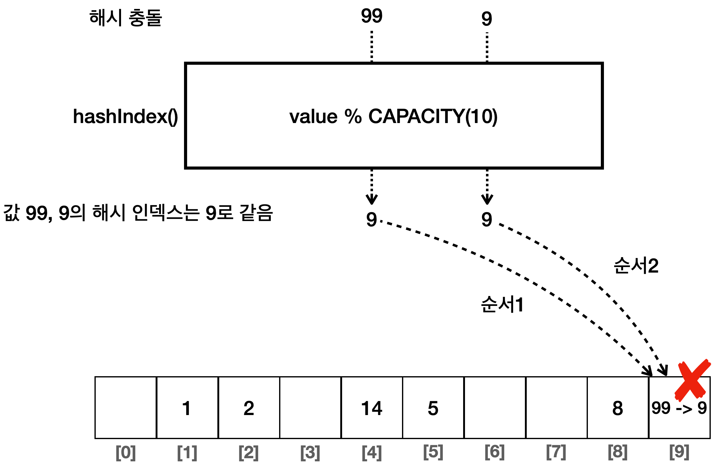
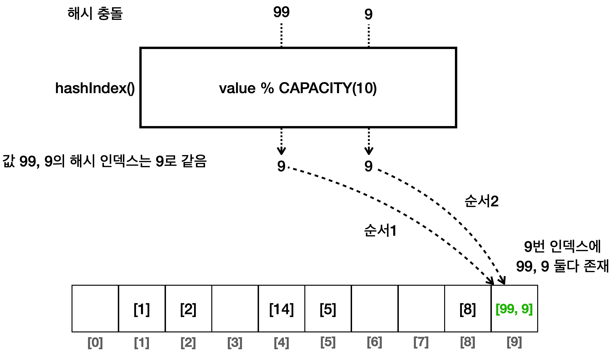
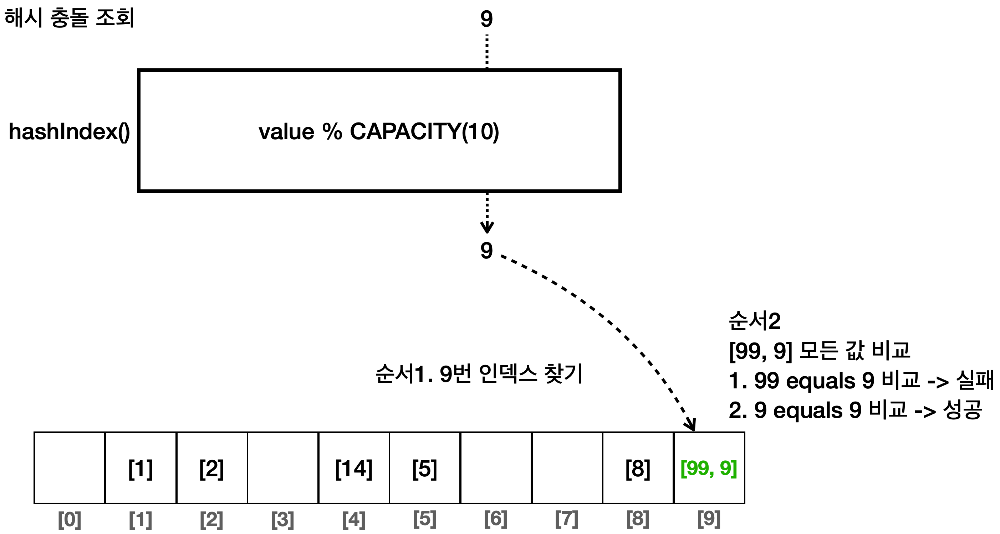
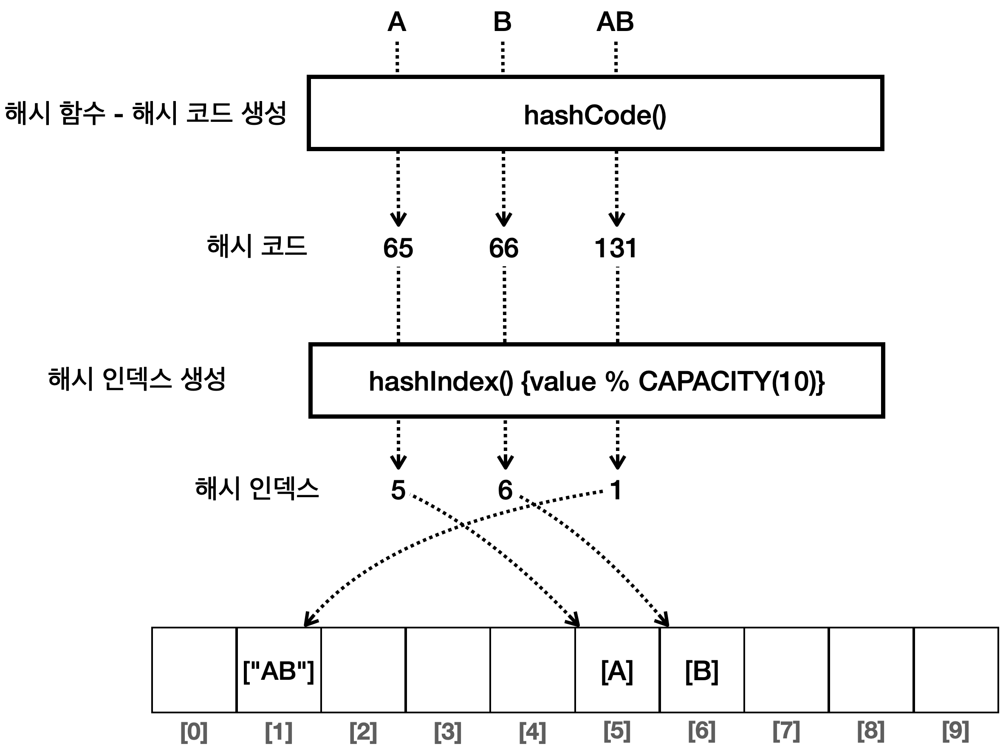
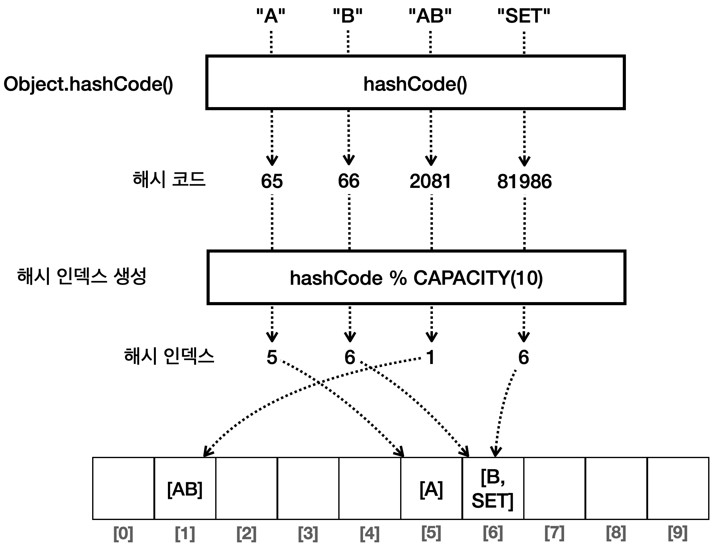
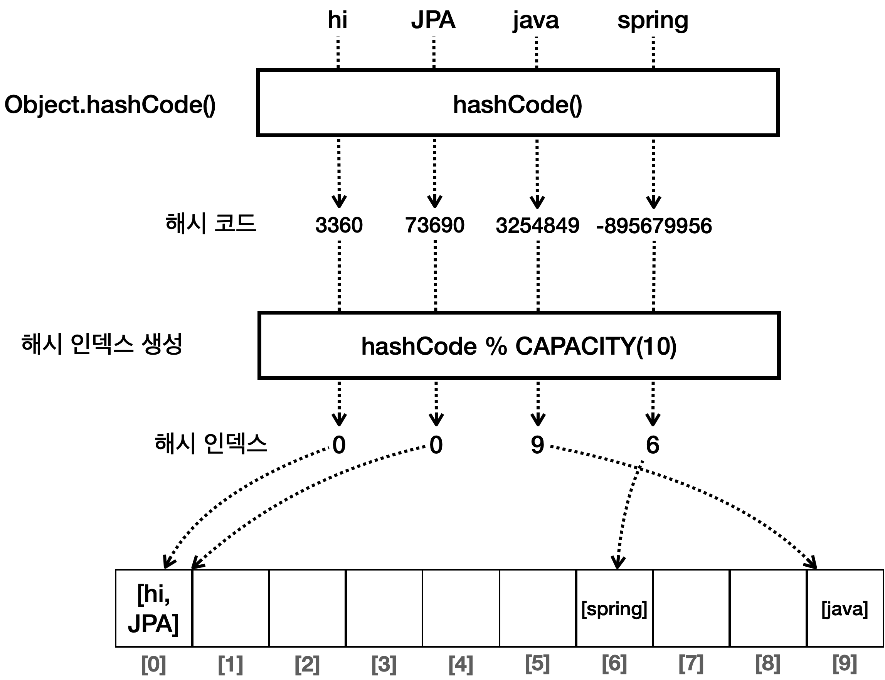

# [ Set ]
- 세트(셋)는 유일한 요소들의 컬렉션이다. 참고로 세트보다는 셋으로 많이 불린다.
- 셋에는 중복된 요소가 존재하지 않는다. 따라서 요소를 추가할 때 이미 존재하는 요소면 무시된다.
- 셋은 요소들의 순서를 보장하지 않는다.
- 정리하면 셋은 중복을 허용하지 않고, 요소의 유무만 중요한 경우에 사용된다.

### Set 구현
- 셋을 구현하는 것은 아주 단순하다.
- 인덱스가 없기 때문에 단순히 데이터를 넣고, 중복을 검사하고, 데이터를 삭제하는 정도면 충분하다.

```java
package collection.set;

import java.util.Arrays;

public class MyHashSetV0 {

    private int[] elementData = new int[10];
    private int size = 0;

    // O(n)
    public boolean add(int value) {
        if (contains(value)) {
            return false;
        }
        elementData[size] = value;
        size++;
        return true;
    }

    // O(n)
    public boolean contains(int value) {
        for (int data : elementData) {
            if (data == value) {
                return true;
            }
        }
        return false;
    }

    public int getSize() {
        return size;
    }

    @Override
    public String toString() {
        return "MyHashSetV0{" +
                "elementData=" + Arrays.toString(Arrays.copyOf(elementData, size)) +
                ", size=" + size +
                '}';
    }

}
```
- 위의 코드를 보면 몇가지 문제점이 보이는데 add()` 로 데이터를 추가할 때 셋에 중복 데이터가 있는지 전체 데이터를 항상 확인해야 한다는 것이다.
- 따라서 O(n)으로 입력 성능이 나쁘다.
- contains()로 데이터를 찾을 때도 배열에 있는 모든 데이터를 찾고 비교해야 하므로 평균 O(n)이 걸린다.

### 정리
- 우리가 만든 셋은 구조는 단순하지만, 데이터 추가, 검색 모두 O(n)으로 성능이 좋지 않다. 
- 특히 데이터가 많을 수 록 효 율은 매우 떨어진다. 
- 검색의 경우 이전에 보았던 `ArrayList` , `LinkedList` 도 O(n)이어서 어느정도 받아들 수 있지
만, 데이터의 추가가 특히 문제이다. 
- 데이터를 추가할 때마다 중복 데이터가 있는지 체크하기 위해 셋의 전체 데이터를 확인해야 한다. 
- 이때 O(n)으로 성능이 떨어진다. 데이터를 추가할 때마다 이렇게 성능이 느린 자료 구조는 사용하기 어
렵다. 
- 결국 중복 데이터를 찾는 부분이 성능의 발목을 잡는 것이다.
- 이런 부분은 해시(hash) 알고리즘을 사용하면 검색 성능을 O(1)로 끌어올릴 수 있다.

# [ 해시 알고리즘 ]
- 해시(Hash)는 한마디로 "다양한 길이를 가진 데이터를 고정된 길이의 고유한 값으로 변환하는 것"을 의미한다.
- 해시 알고리즘을 사용하면 전달받은 "값"을 가지고 인덱스를 생성해서 해당 인덱스에 값을 넣을 수 있다.
- 이렇게 되면 배열에서 인덱스로 값을 찾는 것과 같이 루프를 돌지 않고 바로 값을 찾을 수 있게 된다.

### 값을 index로 사용
- 일단 해시 알고리즘을 적용하기 전에 전달받은 "값"자체를 인덱스로 사용하는 예제를 구성해 보자.

```java
package collection.set;

import java.util.Arrays;

public class HashStart2 {

  public static void main(String[] args) {
    //입력: 1, 2, 5, 8
    //[null, 1, 2, null, null, 5, null, null, 8, null]
    Integer[] inputArray = new Integer[10];
    inputArray[1] = 1;
    inputArray[2] = 2;
    inputArray[5] = 5;
    inputArray[8] = 8;
    System.out.println("inputArray = " + Arrays.toString(inputArray));

    int searchValue = 8;
    Integer result = inputArray[searchValue]; // O(1)
    System.out.println(result);
  }
}
```
- 데이터를 입력할 때 배열에 순서대로 입력하는 것이 아니라, 데이터의 값을 인덱스로 사용해서 저장했다.
- 따라서 값을 조회할 때도 값을 인덱스로 사용해서 조회하게 된다.
- 배열에서 인덱스로 데이터를 찾는 것은 매우 빠르다. 그 덕분에 O(n)의
  검색 성능을 O(1)로 획기적으로 개선할 수 있었다.
- 하지만 입력 값의 범위 만큼 큰 배열을 사용해야 하는 문제가 있어 값이 커지면 배열에 낭비되는 공간이 너무 많이 발생한다.


### 메모리 낭비 문제 

- 위의 경우 만약 데이터가 0~99까지 입력될 수 있다면 크기가 100인 배열이 필요하다.

```java
package collection.set;

import java.util.Arrays;

public class HashStart3 {

    public static void main(String[] args) {
        //{1, 2, 5, 8, 14, 99}
        //[null, 1, 2, null, null, 5, null, null, 8, .., 14 ....., 99]
        Integer[] inputArray = new Integer[100];
        inputArray[1] = 1;
        inputArray[2] = 2;
        inputArray[5] = 5;
        inputArray[8] = 8;
        inputArray[14] = 14;
        inputArray[99] = 99;
        System.out.println("inputArray = " + Arrays.toString(inputArray));

        int searchValue = 99;
        Integer result = inputArray[searchValue]; // O(1)
        System.out.println(result);
    }
}

// 실행 결과
inputArray = [null, 1, 2, null, null, 5, null, null, 8, null, null, null,
        null, null, 14, null, null, null, null, null, null, null, null, null, null,
        null, null, null, null, null, null, null, null, null, null, null, null, null,
        null, null, null, null, null, null, null, null, null, null, null, null, null,
        null, null, null, null, null, null, null, null, null, null, null, null, null,
        null, null, null, null, null, null, null, null, null, null, null, null, null,
        null, null, null, null, null, null, null, null, null, null, null, null, null,
        null, null, null, null, null, null, null, null, null, 99]

        99
```

- 데이터의 값을 인덱스로 사용한 덕분에 빠른 검색 속도는 얻었지만 낭비되는 메모리 공간이 너무 많다.
- 입력 값의 범위가 조금만 커져도 메모리 낭비가
  너무 심하다. 따라서 그대로 사용하기에는 문제가 있다.


### 나머지 연산을 통한 메모리 낭비 문제 해결
- 공간도 절약하면서, 넓은 범위의 값을 사용할 수 있는 방법이 있는데, 바로 나머지 연산을 사용하는 것이다. 
- 저장할 수 있는 배열의 크기(CAPACITY)를 10이라고 가정하자. 그 크기에 맞추어 나머지 연산을 사용하면 된다.

```text
나머지 연산

1 % 10 = 1
2 % 10 = 2
5 % 10 = 5
8 % 10 = 8
14 % 10 = 4
99 % 10 = 9

```
- 여기서 14, 99는 10보다 큰 값이다. 
- 따라서 일반적인 방법으로는 크기가 10인 배열의 인덱스로 사용할 수 없다. 
- 하지만 나머지 연산의 결과를 사용하면 14는 4로, 99는 9로 크기가 10인 배열의 인덱스로 활용할 수 있다. 
- 나머지 연산의 결과는 절대로 배열의 크기를 넘지 않는다.
- 예를 들어 나머지 연산에 10을 사용하면 결과는 `0~9` 까지만
  나온다. 
- 절대로 10이 되거나 10을 넘지 않는다. 따라서 연산 결과는 배열의 크기를 넘지 않으므로 안전하게 인덱스로
  사용할 수 있다.
- 이렇게 배열의 인덱스로 사용할 수 있도록 원래의 값을 계산한 인덱스를 해시 인덱스(hashIndex)라 한다.

### 해시 인덱스를 통한 데이터 저장
- 1, 2, 5, 8, 14 ,99의 값을 크기가 10인 배열에 저장해보자.

- 해시 인덱스를 배열의 인덱스로 사용해서 데이터를 저장한다. 
- 예) `inputArray[hashIndex] = value`인덱스만 해시 인덱스를 사용하고, 값은 원래 값을 저장한다. 
- 배열의 인덱스를 사용하기 때문에 하나의 값을 저장하는데 O(1)로 빠른 성능을 제공한다.
  해시 인덱스 생성 O(1) + 해시 인덱스를 사용해 배열에 값 저장O(1) ->  O(1)

### 해시 인덱스를 통한 데이터 조회


- 조회할 값에 나머지 연산자를 사용해서 해시 인덱스를 구한다.
- 해시 인덱스를 배열의 인덱스로 사용해서 데이터를 조회한다.
- 배열의 인덱스를 사용하기 때문에 하나의 값을 찾는데 O(1)로 빠른 성능을 제공한다.

```java
package collection.set;

import java.util.Arrays;

public class HashStart4 {

    static final int CAPACITY = 10;

    public static void main(String[] args) {
        //{1, 2, 5, 8, 14, 99}
        System.out.println("hashIndex(1) = " + hashIndex(1));
        System.out.println("hashIndex(2) = " + hashIndex(2));
        System.out.println("hashIndex(5) = " + hashIndex(5));
        System.out.println("hashIndex(8) = " + hashIndex(8));
        System.out.println("hashIndex(14) = " + hashIndex(14));
        System.out.println("hashIndex(99) = " + hashIndex(99));

        Integer[] inputArray = new Integer[CAPACITY];
        add(inputArray, 1);
        add(inputArray, 2);
        add(inputArray, 5);
        add(inputArray, 8);
        add(inputArray, 14);
        add(inputArray, 99);
        System.out.println("inputArray = " + Arrays.toString(inputArray));

        //검색
        int searchValue = 14;
        int hashIndex = hashIndex(searchValue);
        System.out.println("searchValue hashIndex = " + hashIndex);
        Integer result = inputArray[hashIndex]; // O(1)
        System.out.println(result);
    }

    private static void add(Integer[] inputArray, int value) {
        int hashIndex = hashIndex(value);
        inputArray[hashIndex] = value;
    }

    static int hashIndex(int value) {
        return value % CAPACITY;
    }
}

// 실행 결과

hashIndex(1) = 1
hashIndex(2) = 2
hashIndex(5) = 5
hashIndex(8) = 8
hashIndex(14) = 4
hashIndex(99) = 9
inputArray = [null, 1, 2, null, 14, 5, null, null, 8, 99]
searchValue hashIndex = 4
14
```
### 정리
- 입력 값의 범위가 넓어도 실제 모든 값이 들어오지는 않기 때문에 배열의 크기를 제한하고, 나머지 연산을 통해 메
모리가 낭비되는 문제도 해결할 수 있다.
- 해시 인덱스를 사용해서 O(1)의 성능으로 데이터를 저장하고, O(1)의 성능으로 데이터를 조회할 수 있게 되었다.
덕분에 자료 구조의 조회 속도를 비약적으로 향상할 수 있게 되었다.
- 그런데 지금까지 설명한 내용은 저장할 위치가 충돌할 수 있다는 한계가 있다. 
- 예를 들어 1, 11의 두 값은 이렇게 10으로 나누면 같은 값 1이 된다. 둘다 같은 해시 인덱스가 나와버리는 것이다.

### 해시 충돌
- 99, 9의 두 값은 10으로 나누면 9가 된다. 따라서 다른 값을 입력했지만 같은 해시 코드가 나오게 되는데 이것을 해시
  충돌이라 한다.


- 문제를 해결하는 가장 단순한 방법은 CAPACITY를 값의 입력 범위만큼 키우면 된다. 
- 여기서는 99까지만 입력하므 로 CAPACITY를 100으로 늘리면 된다. 
- 그러면 충돌이 발생하지 않는다. 하지만 앞서 보았듯이 이 방법은 메모리 낭비
  가 심하고, 모든 `int` 숫자를 다 받는 문제를 해결할 수 없다.

### 해시 충돌 해결
- 해시 충돌을 인정하면 문제 해결의 실마리가 보인다.
- 해시 충돌은 낮은 확률로 일어날 수 있다고 가정하는 것이다.
- 해결 방안은 바로 해시 충돌이 일어났을 때 단순하게 같은 해시 인덱스의 값을 같은 인덱스에 함께 저장해버리는 것이다.
- 물론 여러 데이터를 배열의 하나의 공간에 함께 저장할 수는 없다. 대신에 **배열 안에 배열을 만들면 된다**. 물론 배열 안
  에 리스트 같은 다른 자료구조를 사용해도 된다.


- 9의 해시 인덱스는 9이다. 배열에서 9번 인덱스를 찾는다. 
- 배열 안에는 또 배열이 들어있다. 여기에 있는 모든 값을 검색할 값과 하나씩 비교한다.
- [99, 9]의 데이터가 들어있다. 첫 비교에서 `99 equals 9` 는 거짓이므로 실패한다. 다음 비교에서 `9
equals 9` 이므로 원하는 데이터를 찾았다. 
- 비교시 `equals` 를 사용했지만 기본형이라면 물론 `==` 을 사용해도 된다.



# [ HashSet 구현 ]

- 해시 알고리즘을 사용하도록 MyHashSet을 구현해 보자

```java
package collection.set;

import java.util.Arrays;
import java.util.LinkedList;

public class MyHashSetV1 {

    static final int DEFAULT_INITIAL_CAPACITY = 16;

    LinkedList<Integer>[] buckets;

    private int size = 0;
    private int capacity = DEFAULT_INITIAL_CAPACITY;

    public MyHashSetV1() {
        initBuckets();
    }

    public MyHashSetV1(int capacity) {
        this.capacity = capacity;
        initBuckets();
    }

    private void initBuckets() {
        buckets = new LinkedList[capacity];
        for (int i = 0; i < capacity; i++) {
            buckets[i] = new LinkedList<>();
        }
    }

    public boolean add(int value) {
        int hashIndex = hashIndex(value);
        LinkedList<Integer> bucket = buckets[hashIndex];
        if (bucket.contains(value)) {
            return false;
        }

        bucket.add(value);
        size++;
        return true;
    }
    
    // Hashset의 contains를 통해 배열안에 들어 있는 링크드 리스트를 찾고
    // LinkedList의 내장메서드 contains로 해당 인덱스 번째의 노드를 찾아 값 존재 여부 반환
    public boolean contains(int searchValue) {
        int hashIndex = hashIndex(searchValue);
        LinkedList<Integer> bucket = buckets[hashIndex];
        return bucket.contains(searchValue);
    }

    public boolean remove(int value) {
        int hashIndex = hashIndex(value);
        LinkedList<Integer> bucket = buckets[hashIndex];
        boolean result = bucket.remove(Integer.valueOf(value));
        if (result) {
            size--;
            return true;
        } else {
            return false;
        }
    }

    private int hashIndex(int value) {
        return value % capacity;
    }


    public int getSize() {
        return size;
    }

    @Override
    public String toString() {
        return "MyHashSetV1{" +
                "buckets=" + Arrays.toString(buckets) +
                ", size=" + size +
                '}';
    }
}
```

- `buckets` : 연결 리스트를 배열로 사용한다.
  - 배열안에 연결 리스트가 들어있고, 연결 리스트 안에 데이터가 저장된다.
  - 해시 인덱스가 충돌이 발생하면 같은 연결 리스트 안에 여러 데이터가 저장된다.
- `initBuckets()`
  - 연결 리스트를 생성해서 배열을 채운다. 배열의 모든 인덱스 위치에는 연결 리스트가 들어있다.

- 초기 배열의 크기를 생성자를 통해서 전달할 수 있다.
  - 기본 생성자를 사용하면 `DEFAULT_INITIAL_CAPACITY` 의 값인 16이 사용된다.

- `add()` : 해시 인덱스를 사용해서 데이터를 보관한다.
- `contains()` : 해시 인덱스를 사용해서 데이터를 확인한다.
- `remove()` : 해시 인덱스를 사용해서 데이터를 제거한다.

- 위의 클래스를 사용해보자.

```java
package collection.set;

public class MyHashSetV1Main {

    public static void main(String[] args) {
        MyHashSetV1 set = new MyHashSetV1(10);
        set.add(1);
        set.add(2);
        set.add(5);
        set.add(8);
        set.add(14);
        set.add(99);
        set.add(9); //hashIndex 중복
        System.out.println(set);

        //검색
        int searchValue = 9;
        boolean result = set.contains(searchValue);
        System.out.println("bucket.contains(" + searchValue + ") = " + result);

        //삭제
        boolean removeResult = set.remove(searchValue);
        System.out.println("removeResult = " + removeResult);
        System.out.println(set);
    }
}

// 출력 결과
MyHashSetV1{buckets=[[], [1], [2], [], [14], [5], [], [], [8], [99, 9]], size=7}
bucket.contains(9) = true
removeResult = true
MyHashSetV1{buckets=[[], [1], [2], [], [14], [5], [], [], [8], [99]], size=6}
```
- 생성**: `new MyHashSetV1(10)` 을 사용해서 배열의 크기를 10으로 지정했다. (여기서는 기본 생성자를 사용하
  지 않았다.)

- **저장**: 실행 결과를 보면 `99` , `9` 의 경우 해시 인덱스가 9로 충돌하게 된다. 따라서 배열의 같은 9번 인덱스 위치에
  저장된 것을 확인할 수 있다. 그리고 그 안에 있는 연결 리스트에 `99` , `9` 가 함께 저장된다.

- **검색**: `9` 를 검색하는 경우 해시 인덱스가 `9` 이다. 따라서 배열의 `9` 번 인덱스에 있는 연결 리스트를 먼저 찾는다.
  해당 연결 리스트에 있는 모든 데이터를 순서대로 비교하면서 `9` 를 찾는다.
  먼저 `99` 와 `9` 를 비교한다. ( 실패 )
  다음으로 `9` 와 `9` 를 비교한다. ( 성공 )


### 문자열 해시 코드
- 지금까지 해시 인덱스를 구할 때 숫자를 기반으로 해시 인덱스를 구했다. 
- 해시 인덱스는 배열의 인덱스로 사용해야 하므 로 0, 1, 2, 같은 숫자(양의 정수)만 사용할 수 있다. 
- 따라서 문자를 사용할 수 없다. 
- 문자 데이터를 기반으로 숫자 해시 인덱스를 구하려면 어떻게 해야 할까?

### 아스키 코드
- 모든 문자는 본인만의 고유한 숫자로 표현할 수 있다. 
- 예를 들어서 `'A'` 는 `65` , `'B'` 는 `66` 으로 표현된다. 
- 가장 단순하 게 `char` 형을 `int` 형으로 캐스팅하면 문자의 고유한 숫자를 확인할 수 있다.
  그리고 "AB"와 같은 연속된 문자는 각각의 문자를 더하는 방식으로 숫자로 표현하면 된다. 65 + 66 = 131이다.

```java
package collection.set;

public class StringHashMain {

    static final int CAPATICY = 10;

    public static void main(String[] args) {
        //char
        char charA = 'A';
        char charB = 'B';
        System.out.println(charA + " = " + (int)charA);
        System.out.println(charB + " = " + (int)charB);

        //hash
        System.out.println("hash(A) = " + hashCode("A"));
        System.out.println("hash(B) = " + hashCode("B"));
        System.out.println("hash(AB) = " + hashCode("AB"));

        //hashIndex
        System.out.println("hashIndex(A) = " + hashIndex(hashCode("A")));
        System.out.println("hashIndex(B) = " + hashIndex(hashCode("B")));
        System.out.println("hashIndex(AB) = " + hashIndex(hashCode("AB")));
    }

    static int hashCode(String str) {
        char[] charArray = str.toCharArray();
        int sum = 0;
        for (char c : charArray) {
            sum += c;
        }
        return sum;
    }

    static int hashIndex(int value) {
        return value % CAPATICY;
    }
}
// 출력 결과
A = 65
B = 66
hash(A) = 65
hash(B) = 66
hash(AB) = 131
hashIndex(A) = 5
hashIndex(B) = 6
hashIndex(AB) = 1
```

### 해시 코드와 해시 인덱스
- 위의 코드에서 hashcode함수로 문자를 숫자로 변환했다.
- 이렇게 만들어진 숫자를 해시 코드라고 한다.
- 해시 코드는 객체를 식별할 수 있는 정수값을 의미한다.

- hashCode()` 메서드를 사용해서 문자열을 해시 코드로 변경한다. 
- 그러면 고유한 정수 숫자 값이 나오는데, 이것을 해시 코드라 한다. 
- 숫자 값인 해시 코드를 사용해서 해시 인덱스를 생성한다. 
- 이렇게 생성된 해시 인덱스를 배열의 인덱스로 사용하면 된다.

### 자바의 hashCode()
- 해시 인덱스를 사용하는 해시 자료 구조는 데이터 추가, 검색, 삭제의 성능이 O(1)로 매우 빠르다. 
- 따라서 많은 곳에서 자주 사용된다. 
- 그런데 앞서 학습한 것 처럼 해시 자료 구조를 사용하려면 정수로 된 숫자 값인 해시 코드가 필요하다. 
- 자바에는 정수 `int` , `Integer` 뿐만 아니라 `char` , `String` , `Double` , `Boolean` 등 수 많은 타입이 있다. 
- 뿐만 아 니라 개발자가 직접 정의한 `Member` , `User` 와 같은 사용자 정의 타입도 있다. 
- 이 모든 타입을 해시 자료 구조에 저장하려면 모든 객체가 숫자 해시 코드를 제공할 수 있어야 한다.

### Object.hashCode()

- 자바는 모든 객체가 자신만의 해시 코드를 표현할 수 있는 기능을 제공한다.
- 바로 Object에 있는 hashCode()메서드이다.

```java
public class Object {
    public int hashCode();
}
```

- 이 메서드를 그대로 사용하기 보다는 보통 오버라이딩 해서 사용한다.
- 이 메서드는 기본적으로 객체의 참조값을 기반으로 해시 코드를 생성한다.
- 따라서 객체의 인스턴스가 다르면 해시 코드도 다르다.
- 코드로 구현해 보자.

```java
package collection.set.member;

import java.util.Objects;

public class Member {

    private String id;

    public Member(String id) {
        this.id = id;
    }

    public String getId() {
        return id;
    }

    @Override
    public boolean equals(Object o) {
        if (this == o) return true;
        if (o == null || getClass() != o.getClass()) return false;
        Member member = (Member) o;
        return Objects.equals(id, member.id);
    }

    @Override
    public int hashCode() {
        return Objects.hash(id);
    }

    @Override
    public String toString() {
        return "Member{" +
                "id='" + id + '\'' +
                '}';
    }
}
```

- 위의 코드에서 equals는 전달받은 id값을 가지고 비교를 한다.
- hashcode는 객체의 참조값이 아닌 전달받은 id를 가지고 해시코드를 생성하도록 오버라이딩 되어있다.

- 위의 코드를 사용해보자.
```java
 package collection.set;

import collection.set.member.Member;

public class JavaHashCodeMain {

  public static void main(String[] args) {
    //Object의 기본 hashCode는 객체의 참조값을 기반으로 생성
    Object obj1 = new Object();
    Object obj2 = new Object();
    System.out.println("obj1.hashCode() = " + obj1.hashCode());
    System.out.println("obj2.hashCode() = " + obj2.hashCode());

    //각 클래스마다 hashCode를 이미 오버라이딩 해두었다.
    Integer i = 10;
    String strA = "A";
    String strAB = "AB";
    System.out.println("10.hashCode = " + i.hashCode());
    System.out.println("'A'.hashCode = " + strA.hashCode());
    System.out.println("'AB'.hashCode = " + strAB.hashCode());

    //hashCode는 마이너스 값이 들어올 수 있다.
    System.out.println("-1.hashCode = " + Integer.valueOf(-1).hashCode());

    //둘은 같을까 다를까?, 인스턴스는 다르지만, equals는 같다.
    Member member1 = new Member("idA");
    Member member2 = new Member("idA");

    //equals, hashCode를 오버라이딩 하지 않은 경우와, 한 경우를 비교
    System.out.println("(member1 == member2) = " + (member1 == member2));
    System.out.println("member1 equals member2 = " + member1.equals(member2));
    System.out.println("member1.hashCode() = " + member1.hashCode());
    System.out.println("member2.hashCode() = " + member2.hashCode());
  }
}

// 출력 결과
obj1.hashCode() = 189568618
obj2.hashCode() = 664223387
10.hashCode = 10
'A'.hashCode = 65
'AB'.hashCode = 2081
-1.hashCode = -1
(member1 == member2) = false
member1 equals member2 = true
member1.hashCode() = 104101
member2.hashCode() = 104101
```

- Object의 해시 코드 비교
  - `Object` 가 기본으로 제공하는 `hashCode()` 는 객체의 참조값을 해시 코드로 사용한다. 
  - 따라서 각각의 인스턴 스마다 서로 다른 값을 반환한다. 
  - 그 결과 `obj1` , `obj2` 는 서로 다른 해시 코드를 반환한다.

- 자바의 기본 클래스의 해시 코드
  - `Integer` , `String` 같은 자바의 기본 클래스들은 대부분 내부 값을 기반으로 해시 코드를 구할 수 있도록 `hashCode()` 메서드를 재정의해 두었다.
  - 따라서 데이터의 값이 같으면 같은 해시 코드를 반환한다.
  - 해시 코드의 경우 정수를 반환하기 때문에 마이너스 값이 나올 수 있다.

### 동일성과 동등성 
- 동일성과 동등성에 대해서 다시 한번 복습해 보자.
- 자바는 두 객체가 같다는 표현을 2가지로 분리해서 사용한다.
  - 동일성 ( Identity )
    - == 연산자를 사용해서 두 객체의 참조가 동일한 객체를 가리키고 있는지 확인한다.
  - 동등성 ( Equality )
    - equals() 메서드를 사용하여 두 객체가 논리적으로 동등한지 확인
- 쉽게 이야기해서 동일성은 물리적으로 같은 메모리에 있는 객체인지 참조값을 통해 확인하는 것이고, 동등성은 논리적으로 같은지 확인하는 것이다.
- 동일성은 자바 머신 기준이고 메모리의 참조가 기준이기 때문에 물리적이다. 
- 반면 동등성은 보통 사람이 생각하는 논리적인 것에 기준에 맞춰 값을 비교하기 때문에
논리적이다 라고 표현한다.

### HashSet 기능 추가
- 이전에 구현한 HashSet은 숫자만 저장할 수 있었다.
- 이제 모든 타입을 해시 코드로 변환해여 저장할 수 있는 HashSet을 구현해 보자.

```java
package collection.set;

import java.util.Arrays;
import java.util.LinkedList;

public class MyHashSetV2 {

    static final int DEFAULT_INITIAL_CAPACITY = 16;

    private LinkedList<Object>[] buckets;

    private int size = 0;
    private int capacity = DEFAULT_INITIAL_CAPACITY;

    public MyHashSetV2() {
        initBuckets();
    }

    public MyHashSetV2(int capacity) {
        this.capacity = capacity;
        initBuckets();
    }

    private void initBuckets() {
        buckets = new LinkedList[capacity];
        for (int i = 0; i < capacity; i++) {
            buckets[i] = new LinkedList<>();
        }
    }

    public boolean add(Object value) {
        int hashIndex = hashIndex(value);
        LinkedList<Object> bucket = buckets[hashIndex];
        if (bucket.contains(value)) {
            return false;
        }

        bucket.add(value);
        size++;
        return true;
    }

    public boolean contains(Object searchValue) {
        int hashIndex = hashIndex(searchValue);
        LinkedList<Object> bucket = buckets[hashIndex];
        return bucket.contains(searchValue);
    }

    public boolean remove(Object value) {
        int hashIndex = hashIndex(value);
        LinkedList<Object> bucket = buckets[hashIndex];
        boolean result = bucket.remove(value);
        if (result) {
            size--;
            return true;
        } else {
            return false;
        }
    }

    private int hashIndex(Object value) {
        //hashCode의 결과로 음수가 나올 수 있다. abs()를 사용해서 마이너스를 제거한다.
        return Math.abs(value.hashCode()) % capacity;
    }

    public int getSize() {
        return size;
    }

    @Override
    public String toString() {
        return "MyHashSetV2{" +
                "buckets=" + Arrays.toString(buckets) +
                ", size=" + size +
                ", capacity=" + capacity +
                '}';
    }
}

```

- private LinkedList<Object>[] buckets
  - MyHashSetV1` 은 `Integer` 숫자만 저장할 수 있었다. 여기서는 모든 타입을 저장할 수 있도록 `Object` 를 사
용한다.
  - 추가로 저장, 검색, 삭제 메서드의 매개변수도 `Object` 로 변경했다.

- hashIndex()
  - `hashIndex()` 부분이 변경되었다. 
  - 먼저 `Object` 의 `hashCode()` 를 호출해서 해시 코드를 찾는다. 
  - 그리고 찾은 해시 코드를 배열의 크기( `capacity` )로 나머지 연산을 수행한다. 
  - 이렇게 해시 코드를 기반으로 해시 인덱스를 계산해서 반환한다.
  - `Object` 의 `hashCode()` 를 사용한 덕분에 모든 객체의 `hashCode()` 를 구할 수 있다. 
  - 물론 다형성에 의해 오버라이딩 된 `hashCode()` 가 호출된다.
  - `hashCode()` 의 실행 결과로 음수가 나올 수 있는데, 배열의 인덱스로 음수는 사용할 수 없다. `Math.abs()` 를
    사용하면 마이너스를 제거해서 항상 양수를 얻을 수 있다.
- 위 클래스를 사용해 보자.

```java
package collection.set;

public class MyHashSetV2Main1 {

    public static void main(String[] args) {
        MyHashSetV2 set = new MyHashSetV2(10);
        set.add("A");
        set.add("B");
        set.add("C");
        set.add("D");
        set.add("AB");
        set.add("SET");
        System.out.println(set);

        System.out.println("A.hashCode=" + "A".hashCode());
        System.out.println("B.hashCode=" + "B".hashCode());
        System.out.println("AB.hashCode=" + "AB".hashCode());
        System.out.println("SET.hashCode=" + "SET".hashCode());

        //검색
        String searchValue = "SET";
        boolean result = set.contains(searchValue);
        System.out.println("bucket.contains(" + searchValue + ") = " + result);
    }
}
// 출력 결과
MyHashSetV2{buckets=[[], [AB], [], [], [], [A], [B, SET], [C], [D], []], size=6, capacity=10}
A.hashCode=65
B.hashCode=66
AB.hashCode=2081
SET.hashCode=81986
bucket.contains(SET) = true
```
- 자바의 `String` 은 `hashCode()` 를 재정의해 두었다. 우리는 이 값을 사용하면 된다.
- `hashIndex(Object value)` 에서 `value.hashCode()` 를 호출하면 실제로는 `String` 에서 재정의한
`hashCode()` 가 호출된다. 
- 이렇게 반환된 해시 코드를 기반으로 해시 인덱스를 생성한다. 
- 참고로 자바의 해시 함수는 단순히 문자들을 더하기만 하는 것이 아니라 더 복잡한 연산을 사용해서 해시 코드를
구한다. 



- 이번에는 자바의 객체가 아닌 직접만든 객체를 담아 보자.

```java
package collection.set;

import collection.set.member.Member;

public class MyHashSetV2Main2 {

    public static void main(String[] args) {
        MyHashSetV2 set = new MyHashSetV2(10);
        Member hi = new Member("hi");
        Member jpa = new Member("JPA");
        Member java = new Member("java");
        Member spring = new Member("spring");

        System.out.println("hi.hashCode() = " + hi.hashCode());
        System.out.println("jpa.hashCode() = " + jpa.hashCode());
        System.out.println("java.hashCode() = " + java.hashCode());
        System.out.println("spring.hashCode() = " + spring.hashCode());

        set.add(hi);
        set.add(jpa);
        set.add(java);
        set.add(spring);
        System.out.println(set);

        //검색
        Member searchValue = new Member("JPA");
        boolean result = set.contains(searchValue);
        System.out.println("bucket.contains(" + searchValue + ") = " + result);
    }
}

// 출력 결과
hi.hashCode() = 3360
jpa.hashCode() = 73690
java.hashCode() = 3254849
spring.hashCode() = -895679956
MyHashSetV2{buckets=[[Member{id='hi'}, Member{id='JPA'}], [], [], [], [], [], [Member{id='spring'}], [], [], [Member{id='java'}]], size=4, capacity=10}
bucket.contains(Member{id='JPA'}) = true
```

- Member` 의 `hashCode()` 를 `id` 값을 기반으로 재정의해 두었다.
- `hashIndex(Object value)` 에서 `value.hashCode()` 를 호출하면 실제로는 `Member` 에서 재정의한 `hashCode()` 가 호출된다. 
- 이렇게 반환된 해시 코드를 기반으로 해시 인덱스를 생성한다.


### equals ( ) 사용처
- 위 코드에서 equals() 는 언제 사용 될까?
- "JPA"를 조회할 때 해시 인덱스는 0이다. 따라서 배열의 `0` 번 인덱스를 조회한다.
- 여기에는 `[hi, JPA]` 라는 회원 두 명이 있다. 이것을 하나하나 비교해야 한다. 이때 `equals()` 를 사용해서 비교한다.
- 따라서 해시 자료 구조를 사용할 때는 `hashCode()` 는 물론이고, `equals()` 도 반드시 재정의해야 한다. 
- 참고로 자바가 제공하는 기본 클래스들은 대부분 `hashCode()` , `equals()` 를 함께 재정의해 두었다.


### equals, hashCode의 중요성
- 해시 자료 구조를 사용하려면 `hashCode()` 도 중요하지만, 해시 인덱스가 충돌할 경우를 대비에서 `equals()` 도 반
  드시 재정의해야 한다. 
- 해시 인덱스가 충돌할 경우 같은 해시 인덱스에 있는 데이터들을 하나하나 비교해서 찾아야한다.
- 이때 `equals()` 를 사용해서 비교한다.