# [ 노드와 연결 ]


### ArrayList의 단점
- ArrayList는 내부적으로 배열을 사용해서 데이터를 보관하고 관리 하기 때문에 몇가지 단점이 존재한다.
- 배열은 크기를 미리 확보해야 하기 때문에 데이터가 얼마나 추가될 지 예측 할 수 없는 경우 나머지 공간은 사용되지 않고 낭비 된다.
- 또한 데이터를 중간에 추가해야 할 경우 기존 데이터를 전부 한칸씩 밀어 내기 때문에 성능이 좋지 않다.
- 이러한 단점을 해결하기 위한 것이 LinkedList다.
- LinkedList는 노드라는 것을 만들고 연결하는 방식인데 이로 인해 필요한 만큼만 데이터를 확보하고 데이터를 추가하거나 삭제 할 때 훨씬 효율적이다.
### 노드
- 노드 클래스는 내부에 저장할 데이터인 item과 연결할 다른 노드의 참조값인 next를 가진다.
```java
package collection.link;

public class Node {

    Object item;
    Node next;

    public Node(Object item) {
        this.item = item;
    }


    @Override
    public String toString() {
        StringBuilder sb = new StringBuilder();
        Node x = this;
        sb.append("[");
        while (x != null) {
            sb.append(x.item);
            if (x.next != null) {
                sb.append("->");
            }
            x = x.next;
        }
        sb.append("]");
        return sb.toString();
    }
}

```
- A라는 값을 넣은 노드와 B라는 값을 넣은 노드를 만들고 A의 next에 B의 참조값을 넣으면 아래와 같이 노드끼리 연결된다.
- 아래와 같이 연결되었으니 첫 번째 노드의 `node.next` 를 호출하면 두 번째 노드를 구할 수 있게 되는 것
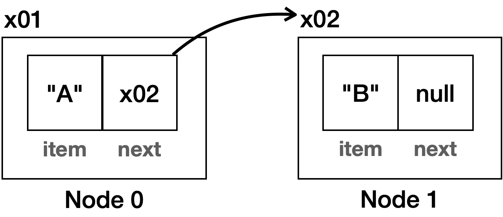

- 노드를 아래와 같이 코드로 연결할 수 있다.
```java
package collection.link;

public class NodeMain1 {

    public static void main(String[] args) {
        //노드 생성하고 연결하기: A -> B -> C
        Node first = new Node("A");
        first.next = new Node("B");
        first.next.next = new Node("C");

        System.out.println("모든 노트 탐색하기");
        Node x = first;
        while (x != null) {
            System.out.println(x.item);
            x = x.next;
        }
    }
}

// 출력 결과
모든 노트 탐색하기
A
B
C
```

- Node x 는 처음 노드부터 순서대로 이동하면서 모든 노드를 가리킨다.
- 처음에 `Node x` 는 `x01` 을 참조한다. 그리고
while 문을 통해 반복해서 다음 노드를 가리킨다.
- while 문은 다음 노드가 없을 때 까지 반복한다. `Node.next` 의 참조값이 `null` 이면 노드의 끝이다.

### 노드 활용
```java
package collection.link;

public class NodeMain3 {

    public static void main(String[] args) {
        //노드 생성하고 연결하기: A -> B -> C
        Node first = new Node("A");
        first.next = new Node("B");
        first.next.next = new Node("C");
        //A -> B -> C

        System.out.println(first);

        //모든 노드 탐색하기
        System.out.println("모든 노트 탐색하기");
        printAll(first);

        //마지막 노드 조회하기
        Node lastNode = getLastNode(first);
        System.out.println("lastNode = " + lastNode);

        //특정 index의 노드 조회하기
        int index = 2;
        Node index2Node = getNode(first, index);
        System.out.println("index2Node = " + index2Node.item);

        //데이터 추가하기
        System.out.println("데이터 추가하기");
        add(first, "D");
        System.out.println(first);
        add(first, "E");
        System.out.println(first);
        add(first, "F");
        System.out.println(first);
    }

    private static void printAll(Node node) {
        Node x = node;
        while (x != null) {
            System.out.println(x.item);
            x = x.next;
        }
    }

    private static void add(Node node, String param) {
        Node lastNode = getLastNode(node);
        lastNode.next = new Node(param);
    }

    private static Node getLastNode(Node node) {
        Node x = node;
        while (x.next != null) {
            x = x.next;
        }
        return x;
    }

    private static Node getNode(Node node, int index) {
        Node x = node;
        for (int i = 0; i < index; i++) {
            x = x.next;
        }
        return x;
    }
}

// 출력 내용
[A->B->C]
모든 노트 탐색하기
        A
B
        C
lastNode = [C]
index2Node = C
데이터 추가하기
[A->B->C->D]
        [A->B->C->D->E]
        [A->B->C->D->E->F]
```

# [ MyLinkedList 구현 ]

- 순서가 있고 중복을 허용하는 자료 구조를 리스트 라고 한다.
- 앞서 만든 ArrayList와 같이 LinkedList도 리스트다.
- 리스트 내부에서 배열을 사용하는가 아니면 노드와 연결구조를 사용하는가의 차이만 있을 뿐이다.
```java
package collection.link;

public class MyLinkedListV1 {

    private Node first;
    private int size = 0;
    
    // 마지막 노드를 찾고 새로운 노드의 참조를 연결한다.
    public void add(Object e) {
        Node newNode = new Node(e);
        if (first == null) {
            first = newNode;
        } else {
            Node lastNode = getLastNode();
            lastNode.next = newNode;
        }
        size++;
    }

    private Node getLastNode() {
        Node x = first;
        while (x.next != null) {
            x = x.next;
        }
        return x;
    }

    public Object set(int index, Object element) {
        Node x = getNode(index);
        Object oldValue = x.item;
        x.item = element;
        return oldValue;
    }

    public Object get(int index) {
        Node node = getNode(index);
        return node.item;
    }

    private Node getNode(int index) {
        Node x = first;
        for (int i = 0; i < index; i++) {
            x = x.next;
        }
        return x;
    }

    public int indexOf(Object o) {
        int index = 0;
        for (Node x = first; x != null; x = x.next) {
            if (o.equals(x.item))
                return index;
            index++;
        }
        return -1;
    }

    public int size() {
        return size;
    }

    @Override
    public String toString() {
        return "MyLinkedListV1{" +
                "first=" + first +
                ", size=" + size +
                '}';
    }
}

```
- Object get(int index)
  - 특정 위치에 있는 데이터를 반환한다.
  - 배열은 인덱스로 원하는 데이터를 즉시 찾을 수 있다. 따라서 배열을 사용하는 배열 리스트( `ArrayList` )
  도 인덱스로 조회시 O(1)의 빠른 성능을 보장한다. 
  - 하지만 연결 리스트에서 사용하는 노드들은 배열이 아니다. 단지 다음 노드에 대한 참조가 있을 뿐이다. 따라서 인덱스로 원하는 위치의 데이터를 찾으려면 인덱스
  숫자 만큼 다음 노드를 반복해서 찾아야 한다.
  - 따라서 인덱스 조회 성능이 나쁘다. 특정 위치의 노드를 찾는데 O(n)이 걸린다.
 
- void add(Object e)
  - 마지막에 데이터를 추가한다.
  - 마지막 노드를 찾는데 O(n)이 소요된다. 마지막 노드에 새로운 노드를 추가하는데 O(1)이 걸린다. 
  - 따라서 O(n)이다.
  
- Object set(int index, Object element)
  - 특정 위치에 있는 데이터를 찾아서 변경한다. 그리고 기존 값을 반환한다.
  - 특정 위치의 노드를 찾는데 O(n)이 걸린다.

- int indexOf(Object o)
    - 데이터를 검색하고, 검색된 위치를 반환한다.
    - 모든 노드를 순회하면서 `equals()` 를 사용해서 같은 데이터가 있는지 찾는다.


# [ MyLinkedList에 데이터 추가 / 삭제 ]

- 먼저 LinkedList에서 특정 위치에 데이터를 추가하고 삭제할때 어떤 경우가 발생하는지 알아보자.

### 첫 번째 위치에 데이터 추가
1.신규 노드 생성

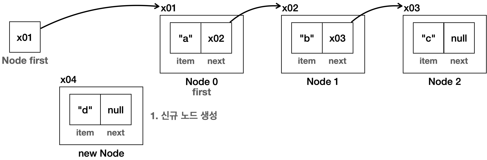

2. 신규 노드와 다음 노드 연결

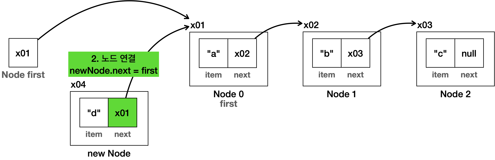

3.first에 신규 노드 연결

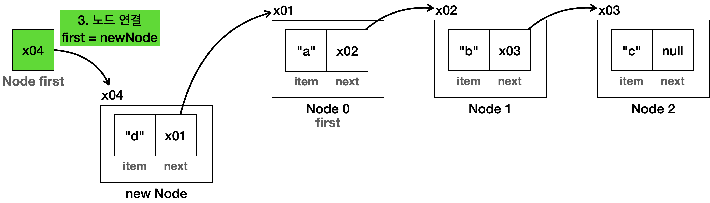

4. 최종 결과

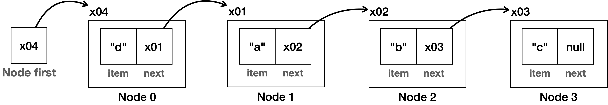

- 배열의 경우 첫 번째 항목에 데이터가 추가되면 모든 데이터를 오른쪽으로 하나씩 밀어야 하지만 연결 리스트는
새로 생성한 노드의 참조만 변경하면 된다. 
- 나머지 노드는 어떤 일이 일어난지도 모른다.
연결 리스트의 첫 번째 항목에 값을 추가하는 것은 매우 빠르다. O(1)로 표현할 수 있다.

### 첫 번째 위치의 데이터 삭제

1. 삭제 대상 선택
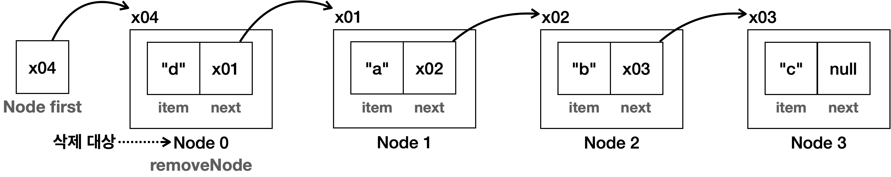
2. first에 삭제 대상의 다음 노드 연결
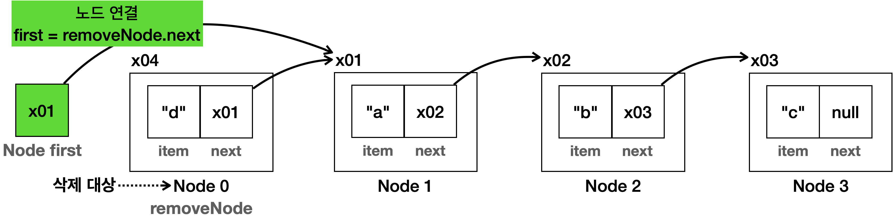
3. 삭제 대상의 데이터 초기화
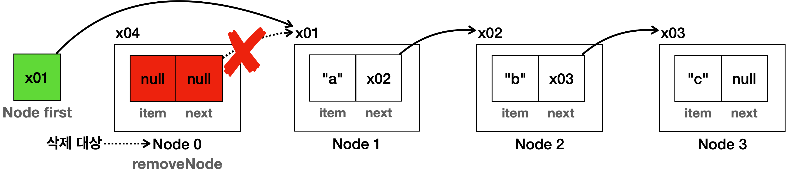
4. 최종 결과
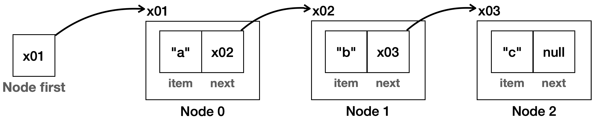
- 노드를 삭제했으므로 오른쪽 노드의 index가 하나씩 당겨진다.
- 배열의 경우 첫 번째 항목이 삭제되면 모든 데이터를 왼쪽으로 하나씩 밀어야 하지만 연결 리스트는 일부 참조만
   변경하면 된다. 
- 나머지 노드는 어떤 일이 일어난지도 모른다.
   연결 리스트의 첫 번째 항목에 값을 삭제하는 것은 매우 빠르다. O(1)로 표현할 수 있다.

### 중간 위치에 데이터 추가
- `[a->b->c]` 로 만들어진 노드의 1번 인덱스 위치에 `e` 를 추가해서 `[a->e->b->c]` 로 변경한다고 가정한다.
1. 새로운 노드를 생성하고, 노드가 입력될 위치의 직전 노드(prev)를 찾아둔다.

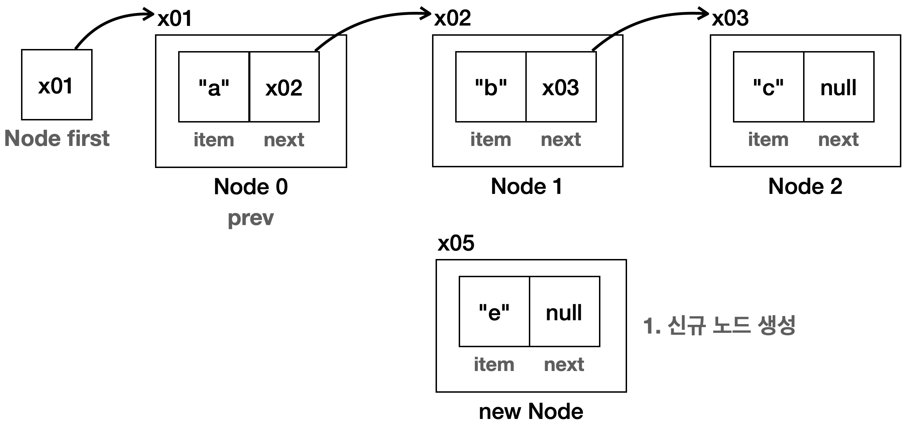
2. 신규 노드와 다음 노드를 연결한다. 직전 노드(prev)의 다음 노드를 연결하면 된다.

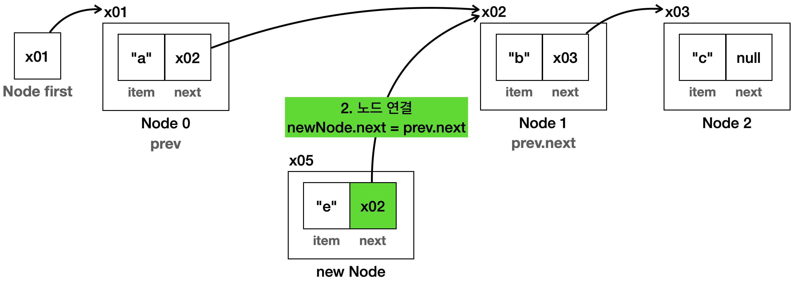
3. 직전 노드(prev)에 신규 노드를 연결한다.

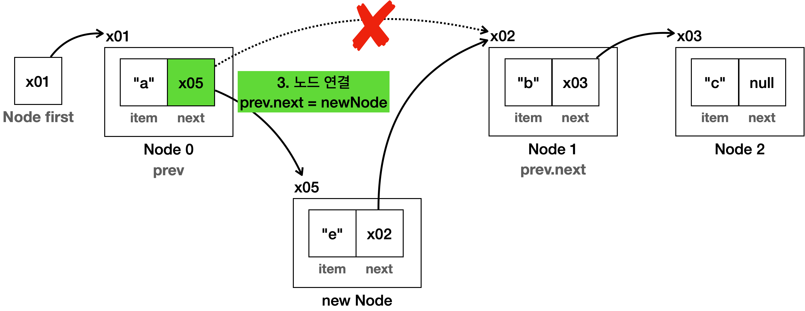
4. 최종 결과

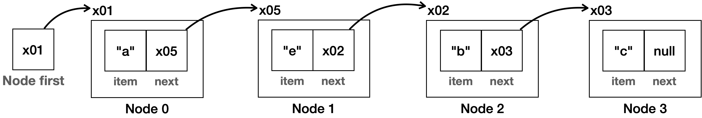

- 노드를 추가했으므로 추가한 노드 오른쪽에 있는 노드들의 index가 하나씩 뒤로 밀려난다.
- 배열의 경우 데이터가 추가되면 인덱스 위치 부터 모든 데이터를 오른쪽으로 하나씩 밀어야 하지만 연결 리스트는
새로 생성한 노드의 참조만 변경하면 된다. 
- 나머지 노드는 어떤 일이 일어난지도 모른다.
- 연결 리스트는 인덱스를 사용해서 노드를 추가할 위치를 찾는데 O(n)이 걸린다.
- 위치를 찾고 노드를 추가하는데는 O(1)이 걸린다.
- 따라서 둘을 합하면 O(n)이 걸린다.

### 중간 위치의 데이터 삭제
1. 삭제 대상을 찾는다. 그리고 삭제 대상의 직전 노드(prev)도 찾아둔다.

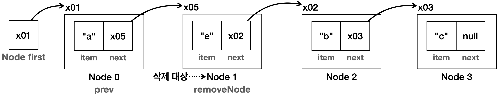
2. 직전 노드(prev)의 다음 노드를 삭제 노드의 다음 노드와 연결한다.

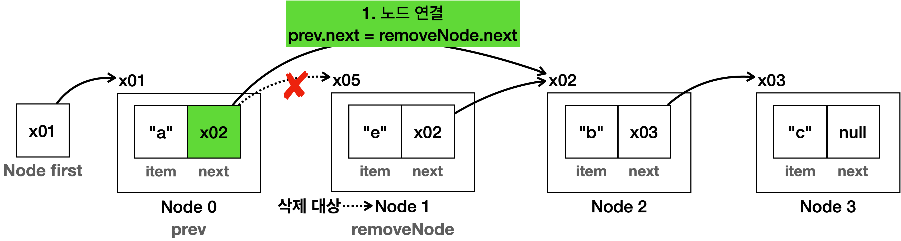
3. 삭제 노드의 데이터를 초기화 한다.

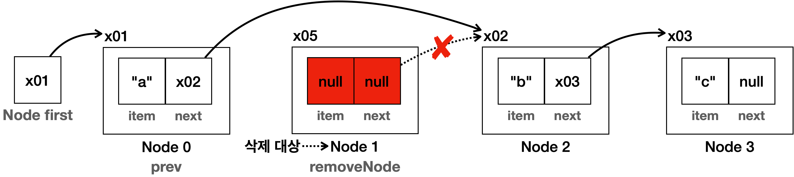

- 더는 삭제 노드를 참조하는 곳이 없다. 삭제 노드는 이후 GC의 대상이 되어서 제거된다.
4. 최종 결과

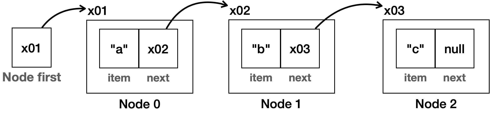

- 노드를 삭제했으므로 오른쪽 노드의 index가 하나씩 당겨진다.
- 연결 리스트에서 인덱스로 삭제할 항목을 찾는데 O(n)이 걸린다.
- 연결 리스트에서 항목을 삭제하는 것은 매우 빠르다. O(1)로 표현할 수 있다.
- 연결 리스트와 배열 리스트 둘다 중간에 있는 항목을 추가하거나 삭제하는 경우 둘다 같은 O(n)이다.


### 메서드 구현

- void add(int index, Object e)
  - 특정 위치에 데이터를 추가한다.
  내부에서 노드도 함께 추가된다.
- Object remove(int index)
  - 특정 위치에 있는 데이터를 제거한다.
  내부에서 노드도 함께 제거된다.
```java

package collection.link;

public class MyLinkedListV2 {
    private Node first;
    private int size = 0;

    public void add(Object e) {
        Node newNode = new Node(e);
        if (first == null) {
            first = newNode;
        } else {
            Node lastNode = getLastNode();
            lastNode.next = newNode;
        }
        size++;
    }

    private Node getLastNode() {
        Node x = first;
        while (x.next != null) {
            x = x.next;
        }
        return x;
    }

    //추가 코드
    public void add(int index, Object e) {
        Node newNode = new Node(e);
        if (index == 0) {
            newNode.next = first;
            first = newNode;
        } else {
            Node prev = getNode(index - 1);
            newNode.next = prev.next;
            prev.next = newNode;
        }
        size++;
    }

    public Object set(int index, Object element) {
        Node x = getNode(index);
        Object oldValue = x.item;
        x.item = element;
        return oldValue;
    }

    //추가 코드
    public Object remove(int index) {
        Node removeNode = getNode(index);
        Object removedItem = removeNode.item;
        if (index == 0) {
            first = removeNode.next;
        } else {
            Node prev = getNode(index - 1);
            prev.next = removeNode.next;
        }
        removeNode.item = null;
        removeNode.next = null;
        size--;
        return removedItem;
    }


    public Object get(int index) {
        Node node = getNode(index);
        return node.item;
    }

    private Node getNode(int index) {
        Node x = first;
        for (int i = 0; i < index; i++) {
            x = x.next;
        }
        return x;
    }

    public int indexOf(Object o) {
        int index = 0;
        for (Node x = first; x != null; x = x.next) {
            if (o.equals(x.item))
                return index;
            index++;
        }
        return -1;
    }

    public int size() {
        return size;
    }

    @Override
    public String toString() {
        return "MyLinkedListV2{" +
                "first=" + first +
                ", size=" + size +
                '}';
    }
}
```

- 위 클래스를 사용해 보자

```java

package collection.link;

public class MyLinkedListV2Main {

    public static void main(String[] args) {
        MyLinkedListV2 list = new MyLinkedListV2();
        //마지막에 추가 //O(n)
        list.add("a");
        list.add("b");
        list.add("c");
        System.out.println(list);

        //첫 번째 항목에 추가, 삭제
        System.out.println("첫 번째 항목에 추가");
        list.add(0,"d"); //O(1)
        System.out.println(list);

        System.out.println("첫 번째 항목 삭제");
        list.remove(0); //remove First O(1)
        System.out.println(list);

        //중간에 항목에 추가, 삭제
        System.out.println("중간 항목에 추가");
        list.add(1,"e"); //O(1)
        System.out.println(list);

        System.out.println("중간 항목 삭제");
        list.remove(1);//remove Last O(n)
        System.out.println(list);
    }
}

// 출력 결과
MyLinkedListV2{first=[a->b->c], size=3}
첫 번째 항목에 추가
MyLinkedListV2{first=[d->a->b->c], size=4}
첫 번째 항목 삭제
MyLinkedListV2{first=[a->b->c], size=3}
중간 항목에 추가
MyLinkedListV2{first=[a->e->b->c], size=4}
중간 항목 삭제
MyLinkedListV2{first=[a->b->c], size=3}
```


### 배열 리스트와 연결 리스트의 성능 비교 표
- 자바가 제공하는 연결리스트는 이전 노드도 참조하는 이중 연결리스트라서 
성능이 더 좋다. 
- 아래 표는 일반적인 연결리스트 라고 생각하자.

| 기능                                  | ArrayList |                 LinkedList                  |
|:------------------------------------|:---------:|:-------------------------------------------:|
| 인덱스 조회                              |   O(1)    |                    O(n)                     |
| 검색                                  |   O(n)    |                    O(n)                     |
| 앞에 추가/삭제                            |   O(n)    |                    O(1)                     |
| 뒤에 추가/삭제                            |   O(1)    | O(n) (Tail 포인터 없을 시) / O(1) (Tail 포인터 있을 시) |
| 평균 추가/삭제              |   O(n)    |                    O(n)                     |

### ArrayList vs LinkedList
- 데이터를 조회할 일이 많고, 뒷 부분에 데이터를 추가한다면 배열 리스트가 보통 더 좋은 성능을 제공한다. 
- 앞쪽의 데이터를 추가하거나 삭제할 일이 많다면 연결 리스트를 사용하는 것이 보통 더 좋은 성능을 제공한다.


# [ 제네릭 도입 ]

- 지금까지 만든 연결 리스트에 제네릭을 도입해서 타입 안전성을 높여보자.
- 참고로 아래 코드를 보면 클래스 안에 클래스가 선언되어 있는데 이를 중첩 클래스라고 한다.
- 중첩 클래스는 특정 클래스 안에서만 사용될 때 주로 사용하며 아래의 경우 외부에 Node클래스가 존재하지만 내부에 Node클래스가 똑같이 있기 때문에 내부의 Node 클래스를 사용하게 된다.
```java

package collection.link;

public class MyLinkedListV3<E> {
    private Node<E> first;
    private int size = 0;

    public void add(E e) {
        Node<E> newNode = new Node<>(e);
        if (first == null) {
            first = newNode;
        } else {
            Node<E> lastNode = getLastNode();
            lastNode.next = newNode;
        }
        size++;
    }

    private Node<E> getLastNode() {
        Node<E> x = first;
        while (x.next != null) {
            x = x.next;
        }
        return x;
    }

    public void add(int index, E e) {
        Node<E> newNode = new Node<>(e);
        if (index == 0) {
            newNode.next = first;
            first = newNode;
        } else {
            Node<E> prev = getNode(index - 1);
            newNode.next = prev.next;
            prev.next = newNode;
        }
        size++;
    }

    public E set(int index, E element) {
        Node<E> x = getNode(index);
        E oldValue = x.item;
        x.item = element;
        return oldValue;
    }

    public E remove(int index) {
        Node<E> removeNode = getNode(index);
        E removedItem = removeNode.item;
        if (index == 0) {
            first = removeNode.next;
        } else {
            Node<E> prev = getNode(index - 1);
            prev.next = removeNode.next;
        }
        removeNode.item = null;
        removeNode.next = null;
        size--;
        return removedItem;
    }

    public E get(int index) {
        Node<E> node = getNode(index);
        return node.item;
    }

    private Node<E> getNode(int index) {
        Node<E> x = first;
        for (int i = 0; i < index; i++) {
            x = x.next;
        }
        return x;
    }

    public int indexOf(E o) {
        int index = 0;
        for (Node<E> x = first; x != null; x = x.next) {
            if (o.equals(x.item))
                return index;
            index++;
        }
        return -1;
    }

    public int size() {
        return size;
    }

    @Override
    public String toString() {
        return "MyLinkedListV1{" +
                "first=" + first +
                ", size=" + size +
                '}';
    }

    private static class Node<E> {
        E item;
        Node<E> next;

        public Node(E item) {
            this.item = item;
        }

        @Override
        public String toString() {
            StringBuilder sb = new StringBuilder();
            Node<E> temp = this;
            sb.append("[");
            while (temp != null) {
                sb.append(temp.item);
                if (temp.next != null) {
                    sb.append("->");
                }
                temp = temp.next;
            }
            sb.append("]");
            return sb.toString();
        }
    }
}
```

- 위 클래스를 사용 해 보자.

```java
public class MyLinkedListV3Main {
    public static void main(String[] args) {
        MyLinkedListV3<String> stringList = new MyLinkedListV3<>();
        stringList.add("a");
        stringList.add("b");
        stringList.add("c");
        String string = stringList.get(0);
        System.out.println("string = " + string);

        MyLinkedListV3<Integer> intList = new MyLinkedListV3<>();
        intList.add(1);
        intList.add(2);
        intList.add(3);
        Integer integer = intList.get(0);
        System.out.println("integer = " + integer);
    }

}
```