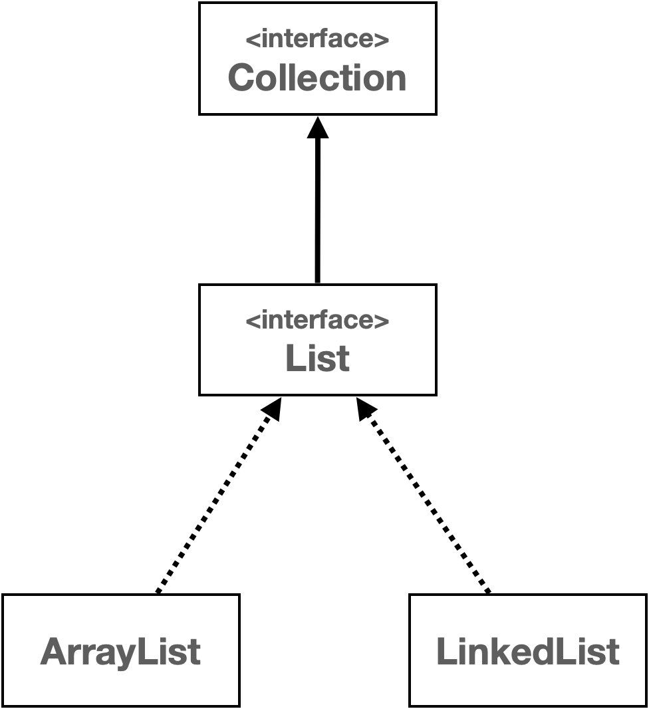
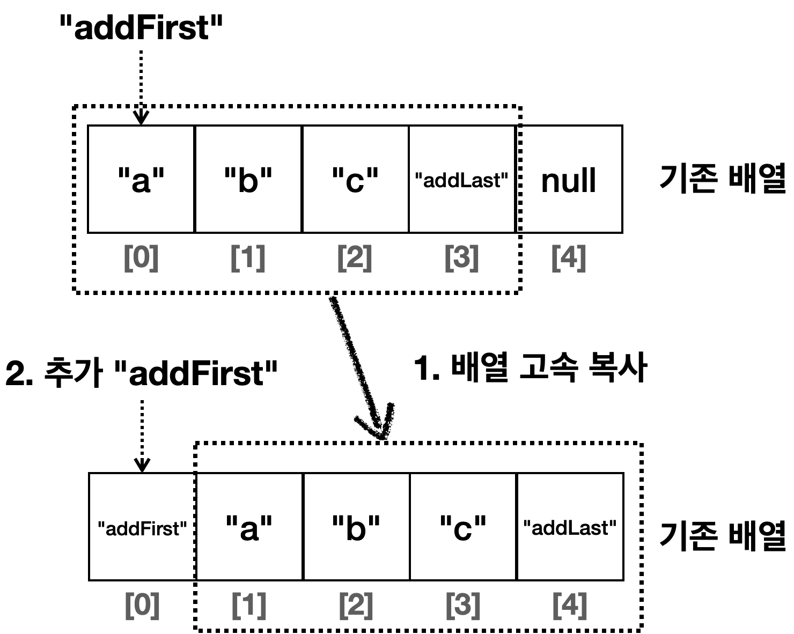
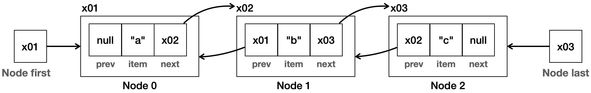

# [ 리스트 추상화1 ( 인터페이스 도입 ) ]

- 순서가 있고 중복을 허용하는 자료구조를 List라고 한다.
- 지금까지 만든 ArrayList와 LinkedList는 내부 구현만 다를 뿐
같은 기능을 제공하는 리스트이다.
- 따라서 이 둘의 공통 기능을 인터페이스로 뽑아서 추상화 하면 다형성을 활용한 다양한 이득을 얻을 수 있다.
- 먼저 ArrayList와 LinkedList에서 같은 기능을 제공하는 메서드를 인터페이스로 뽑아보자.

```java
public interface MyList<E> {

    int size();

    void add(E e);

    void add(int index, E e);

    E get(int index);

    E set(int index, E element);

    E remove(int index);

    int indexOf(E o);

} 
```

- 기존에 만들었던 MyArrayList와 MyLinkedList를 MyList를 구현하는 방식으로 수정 해 보자.

```java
package collection.list;

import java.util.Arrays;

public class MyArrayList<E> implements MyList<E> {

    private static final int DEFAULT_CAPACITY = 5;

    private Object[] elementData;
    private int size = 0;

    public MyArrayList() {
        elementData = new Object[DEFAULT_CAPACITY];
    }

    public MyArrayList(int initialCapacity) {
        elementData = new Object[initialCapacity];
    }

    @Override
    public int size() {
        return size;
    }

    @Override
    public void add(E e) {
        if (size == elementData.length) {
            grow();
        }
        elementData[size] = e;
        size++;
    }

    @Override
    public void add(int index, E e) {
        if (size == elementData.length) {
            grow();
        }
        shiftRightFrom(index);
        elementData[index] = e;
        size++;
    }

    //요소의 마지막부터 index까지 오른쪽으로 밀기
    private void shiftRightFrom(int index) {
        for (int i = size; i > index; i--) {
            elementData[i] = elementData[i - 1];
        }
    }

    @Override
    @SuppressWarnings("unchecked")
    public E get(int index) {
        return (E) elementData[index];
    }

    @Override
    public E set(int index, E element) {
        E oldValue = get(index);
        elementData[index] = element;
        return oldValue;
    }

    @Override
    public E remove(int index) {
        E oldValue = get(index);
        shiftLeftFrom(index);

        size--;
        elementData[size] = null;
        return oldValue;
    }

    //요소의 index부터 마지막까지 왼쪽으로 밀기
    private void shiftLeftFrom(int index) {
        for (int i = index; i < size - 1; i++) {
            elementData[i] = elementData[i + 1];
        }
    }

    @Override
    public int indexOf(E o) {
        for (int i = 0; i < size; i++) {
            if (o.equals(elementData[i])) {
                return i;
            }
        }
        return -1;
    }

    private void grow() {
        int oldCapacity = elementData.length;
        int newCapacity = oldCapacity * 2;
        elementData = Arrays.copyOf(elementData, newCapacity);
    }

    @Override
    public String toString() {
        return Arrays.toString(Arrays.copyOf(elementData, size)) + " size=" + size + ", capacity=" + elementData.length;
    }

}
```

```java
package collection.list;

public class MyLinkedList<E> implements MyList<E> {
    private Node<E> first;
    private int size = 0;

    @Override
    public void add(E e) {
        Node<E> newNode = new Node<>(e);
        if (first == null) {
            first = newNode;
        } else {
            Node<E> lastNode = getLastNode();
            lastNode.next = newNode;
        }
        size++;
    }

    private Node<E> getLastNode() {
        Node<E> x = first;
        while (x.next != null) {
            x = x.next;
        }
        return x;
    }

    @Override
    public void add(int index, E e) {
        Node<E> newNode = new Node<>(e);
        if (index == 0) {
            newNode.next = first;
            first = newNode;
        } else {
            Node<E> prev = getNode(index - 1);
            newNode.next = prev.next;
            prev.next = newNode;
        }
        size++;
    }

    @Override
    public E set(int index, E element) {
        Node<E> x = getNode(index);
        E oldValue = x.item;
        x.item = element;
        return oldValue;
    }

    @Override
    public E remove(int index) {
        Node<E> removeNode = getNode(index);
        E removedItem = removeNode.item;
        if (index == 0) {
            first = removeNode.next;
        } else {
            Node<E> prev = getNode(index - 1);
            prev.next = removeNode.next;
        }
        removeNode.item = null;
        removeNode.next = null;
        size--;
        return removedItem;
    }

    @Override
    public E get(int index) {
        Node<E> node = getNode(index);
        return node.item;
    }

    private Node<E> getNode(int index) {
        Node<E> x = first;
        for (int i = 0; i < index; i++) {
            x = x.next;
        }
        return x;
    }

    @Override
    public int indexOf(E o) {
        int index = 0;
        for (Node<E> x = first; x != null; x = x.next) {
            if (o.equals(x.item))
                return index;
            index++;
        }
        return -1;
    }

    @Override
    public int size() {
        return size;
    }

    @Override
    public String toString() {
        return "MyLinkedListV1{" +
                "first=" + first +
                ", size=" + size +
                '}';
    }

    private static class Node<E> {
        E item;
        Node<E> next;

        public Node(E item) {
            this.item = item;
        }

        @Override
        public String toString() {
            StringBuilder sb = new StringBuilder();
            Node<E> temp = this;
            sb.append("[");
            while (temp != null) {
                sb.append(temp.item);
                if (temp.next != null) {
                    sb.append("->");
                }
                temp = temp.next;
            }
            sb.append("]");
            return sb.toString();
        }
    }
}
```

# [ 리스트 추상화2 ( 의존 관계 주입 )]
- 먼저 이전에 MyArrayList를 의존하는 배치 프로세스를 하나 만들어 보자.

```java
public class BatchProcessor {
    
    private final MyArrayList<Integer> list = new MyArrayList<>(); //코드 변경
    
    public void logic(int size) {
        for (int i = 0; i < size; i++) {
            list.add(0, i); //앞에 추가
        }
    }
}
```

- 만약 위 상황에서 MyLinkedList로 변경을 해야 한다면 코드를 직접적을 수정해야 한다.

```java
public class BatchProcessor {
    
    private final MyLinkedList<Integer> list = new MyLinkedList<>(); //코드 변경
    
    public void logic(int size) {
        for (int i = 0; i < size; i++) {
            list.add(0, i); //앞에 추가
        }
    }
}
```

- 이렇게 구현체를 직접 사용하는 것을 구체적인 클래스에 의존한다고 표현한다.
- 이렇게 구체적인 클래스에 의존하면 변경할때 마다 BatchProcessor의 코드도 함께 수정해야 한다.
- 이번에는 인터페이스에 의존하게 수정 해 보자.

```java
public class BatchProcessor {

    private final MyList<Integer> list;

    public BatchProcessor(MyList<Integer> list) {
        this.list = list;
    }

    public void logic(int size) {
        long startTime = System.currentTimeMillis();
        for (int i = 0; i < size; i++) {
            list.add(0, i); //앞에 추가
        }
        long endTime = System.currentTimeMillis();
        System.out.println("크기: " + size + ", 계산 시간: " + (endTime - startTime) + "ms");
    }

}
```
- 위의 경우 처럼 인터페이스에 의존하게 되면 해당 클래스 생성 시점에 구현체를 전달해서 
구현체 변경이 필요할시 BatchProcessor의 코드 수정 없이 생성자에 전달하는 구현체만 변경하면 된다.

```java
main() {
    new BatchProcessor(new MyArrayList()); //MyArrayList를 사용하고 싶을 때
    new BatchProcessor(new MyLinkedList()); //MyLinkedList를 사용하고 싶을 때
}
```

- 이 방식을 BatchProcessor의 관점엥서 보면 실행 시점에 외부에서 구현체가 주입된다.
- 따라서 이것을 의존관계 주입, Dependency Injection 이라 한다.

# [ 리스트 추상화3 ( 컴파일 타임 의존관계 / 런타임 의존관계)]

### 컴파일 타임 의존관계
- 컴파일 타임 의존관계는 자바 컴파일러가 보는 의존관계이다.
- 쉽게 이야기 해서 클래스에 바로 보이는 즉, 실행하지 않은 소스 코드에 정적으로 나타나는 의존관계이다.
- 아래 BathProcessor 코드를 보자.
```java
public class BatchProcessor {

    private final MyList<Integer> list;

    public BatchProcessor(MyList<Integer> list) {
        this.list = list;
    }

    public void logic(int size) {
        long startTime = System.currentTimeMillis();
        for (int i = 0; i < size; i++) {
            list.add(0, i); //앞에 추가
        }
        long endTime = System.currentTimeMillis();
        System.out.println("크기: " + size + ", 계산 시간: " + (endTime - startTime) + "ms");
    }

} 
```
- 위 클래스에서 프로그램 동작시 list에 어떤 구현체가 주입될지는 모르지만 클래스에 MyList만 정의되어 있으므로 BatchProcessor는 MyList에 의존한다고 
생각하면 된다.
### 런타임 의존관계
- 런타임 의존관계는 실제 프로그램이 작동할 때 보이는 의존관계다. 주로 생성된 인스턴스와 그것을 참조하는 의존
  관계이다.
- 쉽게 이야기해서 프로그램이 실행될 때 인스턴스 간에 의존관계로 보면 된다.
- 런타임 의존관계는 프로그램 실행 중에 계속 변할 수 있다.

```java
MyArrayList<Integer> list = new MyArrayList<>();
BatchProcessor processor = new BatchProcessor(list);
processor.logic(50_000);
```
- BatchProcessor` 인스턴스의 `MyList list` 는 생성자를 통해 `MyArrayList(x001)` 인스턴스를 참조한
  다.
- 따라서 이후 `logic()` 을 호출하면 `MyArrayList` 인스턴스를 사용하게 된다.

### 정리
- MyList` 인터페이스의 도입으로 같은 리스트 자료구조를 그대로 사용하면서 원하는 구현을 변경할 수 있게 되었
  다.
- BatchProcessor` 클래스는 구체적인 `MyArrayList` 나 `MyLinkedList` 에 의존하는 것이 아니라 추상적
인 `MyList` 에 의존한다. 
- 따라서 런타임에 `MyList` 의 구현체를 얼마든지 선택할 수 있다.
- BatchProcessor` 에서 사용하는 리스트의 의존관계를 클래스에서 미리 결정하는 것이 아니라, 런타임에 객체
를 생성하는 시점으로 미룬다. 
- 따라서 런타임에 `MyList` 의 구현체를 변경해도 `BatchProcessor` 의 코드는 전
  혀 변경하지 않아도 된다.
- 이렇게 생성자를 통해 런타임 의존관계를 주입하는 것을 **생성자 의존관계 주입** 또는 줄여서 **생성자 주입**이라 한
  다.
- 클라이언트 클래스는 컴파일 타임에 추상적인 것에 의존하고, 런타임에 의존 관계 주입을 통해 구현체를 주입받아
  사용함으로써, 이런 이점을 얻을 수 있다.

### 전략 패턴
- 디자인 패턴 중에 가장 중요한 패턴을 하나 뽑으라고 하면 전략 패턴을 뽑을 수 있다. 
- 전략 패턴은 알고리즘을 클 라이언트 코드의 변경 없이 쉽게 교체할 수 있다. 
- 방금 설명한 코드가 바로 전략 패턴을 사용한 코드이다.
`MyList` 인터페이스가 바로 전략을 정의하는 인터페이스가 되고, 각각의 구현체인 `MyArrayList` ,`MyLinkedList` 가 전략의 구체적인 구현이 된다. 
- 그리고 전략을 클라이언트 코드( `BatchProcessor` )의 변경없이 손쉽게 교체할 수 있다.

# [ 자바 리스트 ]

- 지금까지는 리스트를 직접 추상화해서 구현했다.
- 이제는 실제 자바가 제공하는 리스트에 대해서 알아보자.
- 순서가 있고, 중복을 허용하는 자료 구조를 리스트라 한다. 자바의 컬렉션 프레임워크가 제공하는 가장 대표적인 자료
  구조가 바로 리스트이다. 
- 리스트와 관련된 컬렉션 프레임워크는 다음 구조를 가진다.



### Collection 인터페이스
- Collection` 인터페이스는 `java.util` 패키지의 컬렉션 프레임워크의 핵심 인터페이스 중 하나이다. 
- 이 인터페이
스는 자바에서 다양한 컬렉션, 즉 데이터 그룹을 다루기 위한 메서드를 정의한다. 
- `Collection` 인터페이스는 `List` ,
`Set` , `Queue` 와 같은 다양한 하위 인터페이스와 함께 사용되며, 이를 통해 데이터를 리스트, 세트, 큐 등의 형태로 관
리할 수 있다. 

### List 인터페이스
- List` 인터페이스는 `java.util` 패키지에 있는 컬렉션 프레임워크의 일부다. `List` 는 객체들의 순서가 있는 컬렉
션을 나타내며, 같은 객체의 중복 저장을 허용한다. 
- 이 리스트는 배열과 비슷하지만, 크기가 동적으로 변화하는 컬렉션
을 다룰 때 유연하게 사용할 수 있다.
- `List` 인터페이스는 `ArrayList` , `LinkedList` 와 같은 여러 구현 클래스를 가지고 있으며, 각 클래스는 `List` 인
터페이스의 메서드를 구현한다.

### List 인터페이스의 주요 메서드

| 메서드                                          | 설명 |
|:---------------------------------------------| :--- |
| add(E e)                                     | 리스트의 끝에 지정된 요소를 추가한다. |
| add(int index, E element)                    | 리스트의 지정된 위치에 요소를 삽입한다. |
| addAll(Collection<? extends E> c)            | 지정된 컬렉션의 모든 요소를 리스트의 끝에 추가한다. |
| addAll(int index, Collection<? extends E> c) | 지정된 컬렉션의 모든 요소를 리스트의 지정된 위치에 추가한다. |
| get(int index)                               | 리스트에서 지정된 위치의 요소를 반환한다. |
| set(int index, E element)                    | 지정한 위치의 요소를 변경하고, 이전 요소를 반환한다. |
| remove(int index)                            | 리스트에서 지정된 위치의 요소를 제거하고 그 요소를 반환한다. |
| remove(Object o)                             | 리스트에서 지정된 첫 번째 요소를 제거한다. |
| clear()                                      | 리스트에서 모든 요소를 제거한다. |
| indexOf(Object o)                            | 리스트에서 지정된 요소의 첫 번째 인덱스를 반환한다. |
| lastIndexOf(Object o)                        | 리스트에서 지정된 요소의 마지막 인덱스를 반환한다. |
| contains(Object o)                           | 리스트가 지정된 요소를 포함하고 있는지 여부를 반환한다. |
| sort(Comparator<? super E> c)                | 리스트의 요소를 지정된 비교자에 따라 정렬한다. |
| subList(int fromIndex, int toIndex)          | 리스트의 일부분의 뷰를 반환한다. |
| size()                                       | 리스트의 요소 수를 반환한다. |
| isEmpty()                                    | 리스트가 비어있는지 여부를 반환한다. |
| iterator()                                   | 리스트의 요소에 대한 반복자를 반환한다. |
| toArray()                                    | 리스트의 모든 요소를 배열로 반환한다. |
| toArray(T[ ] a)                              | 리스트의 모든 요소를 지정된 배열로 반환한다. |


### 자바 ArrayList
- 배열을 사용해서 데이터를 관리한다.
- 기본 `CAPACITY` 는 10이다.( `DEFAULT_CAPACITY = 10` )
  - `CAPACITY` 를 넘어가면 배열을 50% 증가한다.
  - 10 15 22 33 49로 증가한다. (최적화는 자바 버전에 따라 달라질 수 있다.)
  
- 메모리 고속 복사 연산을 사용한다.
  - `ArrayList` 의 중간 위치에 데이터를 추가하면, 추가할 위치 이후의 모든 요소를 한 칸씩 뒤로 이동시켜야
  한다.
  - 자바가 제공하는 `ArrayList` 는 이 부분을 최적화 하는데, 배열의 요소 이동은 시스템 레벨에서 최적화된
  메모리 고속 복사 연산을 사용해서 비교적 빠르게 수행된다. 
  - 참고로 `System.arraycopy()` 를 사용한다.

### ArrayList의 메모리 고속 복사 연산
- 자바의 ArrayList에서 데이터를 추가할 때 먼저 공간 확보를 위해 추가하고자 하는 위치 다음 요소 부터 끝까지 한칸씩 뒤로 이동하게 된다.
- 이때 일반적인 루프로 이동시키는 것이 아니라 System.arraycopy()라는 메서드를 사용해서 통째로 옮기게 된다.
- 이걸 고속 복사 연산이라고 하며 일반적인 루프 문 보다 압도적인 성능을 발휘한다.
- 참고로 통째로 복사하더라고 여전히 데이터 개수에 비례하여 작업량이 늘어나기 때문에 시간복잡도는 여젼히 O(n)이다.
- 따라서 리스트의 크기가 수백만 건 이상으로 커지면 LinkedList에 비해 삽입 성능에 밀리는 지점이 반드시 온다.


### 자바 LinkedList
- 단일 연결 리스트가 아닌 이중 연결 리스트 구조이며, 첫번째 노드와 마지막 노드 둘다 참조한다.



- 이 구조는 다음 노드 뿐만 아니라 이전 노드로도
  이동할 수 있다.
-   예) `node.next` 를 호출하면 다음 노드로, `node.prev` 를 호출하면 이전 노드로 이동한다.

- 마지막 노드에 대한 참조를 제공한기 때문에 데이터를 마지막에 추가하는 경우에도 O(1)의 성능을 제공한다.
- 이전 노드로 이동할 수 있기 때문에 마지막 노드부터 앞으로, 그러니까 역방향으로 조회할 수 있다.
- 덕분에 인덱스 조회 성능을 최적화 할 수 있다.
- 예를 들어 인덱스로 조회하는 경우 인덱스가 사이즈의 절반 이하라면 처음부터 찾아서 올라가고, 인덱스가
사이즈의 절반을 넘으면 마지막 노드 부터 역방향으로 조회해서 성능을 최적화 할 수 있다.

```java
class Node {
  E item;
  Node next;
  Node prev;
}


class LinkedList {
  Node first; //첫 번째 노드 참조
  Node last; //마지막 노드 참조
  int size;
}
```