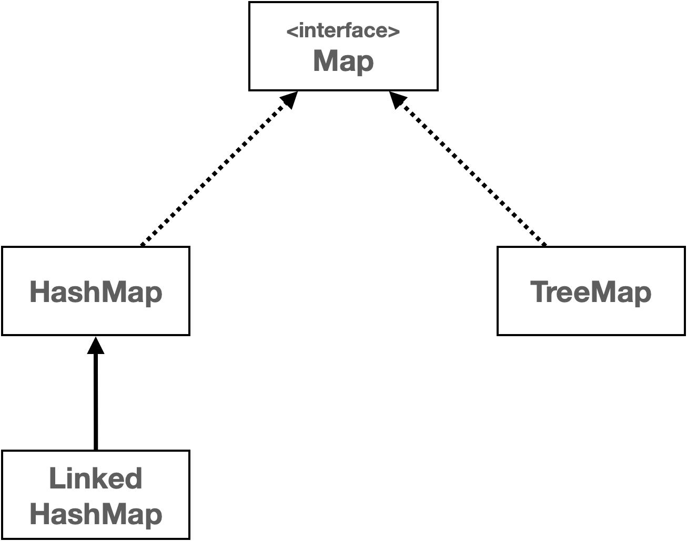

# Map
- Map은 키 - 값의 쌍을 저장하는 자료 구조이다.
- 키는 맵 내에서 유일해야 한다. 그리고 키를 통해 값을 빠르게 검색할 수 있다.
- 키는 중복될 수 없지만, 값은 중복될 수 있다.
- Map은 순서를 유지하지 않는다.

- 자바는 `HashMap` , `TreeMap` , `LinkedHashMap` 등 다양한 `Map` 구현체를 제공한다. 이들은 `Map` 인터페이스의 메
    서드를 구현하며, 각기 다른 특성과 성능 특징을 가지고 있다.
- 이 중에 `HashMap` 을 가장 많이 사용한다. 자세한 사용법을 예제 코드로 알아보자.

```java
public class MapMain1 {

    public static void main(String[] args) {
        Map<String, Integer> studentMap = new HashMap<>();

        // 학생 성적 데이터 추가
        studentMap.put("studentA", 90);
        studentMap.put("studentB", 80);
        studentMap.put("studentC", 80);
        studentMap.put("studentD", 100);
        System.out.println(studentMap);

        // 특정 학생의 값 조회
        Integer result = studentMap.get("studentD");
        System.out.println("result = " + result);

        System.out.println("KeySet 활용");
        Set<String> keySet = studentMap.keySet();
        for (String key : keySet) {
            Integer value = studentMap.get(key);
            System.out.println("key=" + key + ", value=" + value);
        }

        System.out.println("entrySet 활용");
        Set<Map.Entry<String, Integer>> entries = studentMap.entrySet();
        for (Map.Entry<String, Integer> entry : entries) {
            String key = entry.getKey();
            Integer value = entry.getValue();
            System.out.println("key=" + key + ", value=" + value);
        }

        System.out.println("values 활용");
        Collection<Integer> values = studentMap.values();
        for (Integer value : values) {
            System.out.println("value = " + value);
        }

    }
}

// 출력결과
{studentB=80, studentA=90, studentD=100, studentC=80}
result = 100
KeySet 활용
key=studentB, value=80
key=studentA, value=90
key=studentD, value=100
key=studentC, value=80
entrySet 활용
key=studentB, value=80
key=studentA, value=90
key=studentD, value=100
key=studentC, value=80
values 활용
value = 80
value = 90
value = 100
value = 80
```

- Map 의 키는 중복을 허용하지 않는다. 따라서 `Map` 의 모든 키 목록을 조회하는 `keySet()` 을 호출하면, 중복을 허용
하지 않는 자료 구조인 `Set` 을 반환한다.
- Entry 는 키-값의 쌍으로 이루어진 간단한 객체이다. `Entiry` 는 `Map` 내부에서 키와 값을 함께 묶어서 저장할 때 사용한다.
- Map의 값 목록은 중복을 허용한다. 따라서 중복을 허용하지 않는 `Set` 으로 반환할 수는 없다. 그리고 입력 순서를 보
장하지 않기 때문에 순서를 보장하는 `List` 로 반환하기도 애매하다. 따라서 단순히 값의 모음이라는 의미의 상위 인터페이스인 `Collection` 으로 반환한다.

# 같은 키로 데이터 저장시
- 같은 키로 다른 데이터를 저장하면 어떻게 될까?
```java

public class MapMain2 {

    public static void main(String[] args) {
        Map<String, Integer> studentMap = new HashMap<>();

        // 학생 성적 데이터 추가
        studentMap.put("studentA", 90);
        System.out.println(studentMap);

        studentMap.put("studentA", 100); //같은 키에 저장시 기존 값 교체
        System.out.println(studentMap);

        boolean containsKey = studentMap.containsKey("studentA");
        System.out.println("containsKey = " + containsKey);

        // 특정 학생의 값 삭제
        studentMap.remove("studentA");
        System.out.println(studentMap);
    }
}

// 실행 결과
{studentA=90}
{studentA=100}
containsKey = true
{}
```

- Map` 에 값을 저장할 때 같은 키에 다른 값을 저장하면 기존 값을 교체한다.
- `studentA=90` 에서 `studentA=100` 으로 변경된 것을 확인할 수 있다.
- 만약 같은 학생이 `Map` 에 없는 경우에만 데이터를 저장하려면 어떻게 해야할까?

```java
public class MapMain3 {

    public static void main(String[] args) {
        Map<String, Integer> studentMap = new HashMap<>();

        // 학생 성적 데이터 추가
        studentMap.put("studentA", 50);
        System.out.println(studentMap);

        // 학생이 없는 경우에만 추가1
        if (!studentMap.containsKey("studentA")) {
            studentMap.put("studentA", 100);
        }
        System.out.println(studentMap);

        // 학생이 없는 경우에만 추가2
        studentMap.putIfAbsent("studentA", 100);
        studentMap.putIfAbsent("studentB", 100);
        System.out.println(studentMap);
    }
}

// 실행 결과
{studentA=50}
{studentA=50}
{studentB=100, studentA=50}
```

- putIfAbsent()` 는 영어 그대로 없는 경우에만 입력하라는 뜻이다. 
- 이 메서드를 사용하면 키가 없는 경우에만 데이
  터를 저장하고 싶을 때 if문 없이 코드 한줄로 편리하게 처리할 수 있다.

# Map 구현체
- 자바의 `Map` 인터페이스는 키-값 쌍을 저장하는 자료 구조이다. 
- `Map` 은 인터페이스이기 때문에, 직접 인스턴스를 생성할 수는 없고, 대신 `Map` 인터페이스를 구현한 여러 클래스를 통해 사용할 수 있다. 
- 대표적으로 `HashMap` , `TreeMap` ,`LinkedHashMap` 이 있다.
- Map 의 키는 중복을 허용하지 않고, 순서를 보장하지 않는다.
- `Map` 의 키가 바로 `Set` 과 같은 구조이다. 
- 그리고 `Map` 은 모든 것이 `Key` 를 중심으로 동작한다.
- `Value` 는 단순히 `Key` 옆에 따라 붙은 것 뿐이다. `Key` 옆에 `Value` 만 하나 추가해주면 `Map` 이 되는 것이다.
- `Map` 과 `Set` 은 거의 같다. 단지 옆에 `Value` 를 가지고 있는가 없는가의 차이가 있을 뿐이다.
- 구현체를 사용해 보자

```java
public class JavaMapMain {

    public static void main(String[] args) {
        run(new HashMap<>());
        run(new LinkedHashMap<>());
        run(new TreeMap<>());
    }

    private static void run(Map<String, Integer> map) {
        System.out.println("map = " + map.getClass());
        map.put("C", 10);
        map.put("B", 20);
        map.put("A", 30);
        map.put("1", 40);
        map.put("2", 50);

        Set<String> keySet = map.keySet();
        Iterator<String> iterator = keySet.iterator();
        while (iterator.hasNext()) {
            String key = iterator.next();
            System.out.print(key + "=" + map.get(key) + " ");
        }
        System.out.println();
    }
}

// 실행 결과
map = class java.util.HashMap
A=30 1=40 B=20 2=50 C=10
map = class java.util.LinkedHashMap
C=10 B=20 A=30 1=40 2=50
map = class java.util.TreeMap
1=40 2=50 A=30 B=20 C=10 
```

### HashMap
- HashMap은 해시를 사용해서 요소를 저장한다. 키 값은 해시 함수를 통해 해시 코드로 변환되고, 
이 해시 코드는 데이터를 저장하고 검색하는데 사용된다.
- 삽입, 삭제, 검색 작업은 해시 자료 구조를 사용하므로 O(1)의 시간복잡도를 가진다.
- 순서를 보장하지 않는다.

### LinkedHashMap
- LinkedHashMap은 HashMap과 유사하지만, 연결 리스트를 사용하여 삽입 순서 또는 최근 접근 순서에 따라 요소를 유지한다.
- 따라서 입력 순서에 따라 순회가 가능하다.
- HashMap과 같지만 입력 순서를 링크로 유지하기 때문에 조금더 무겁지만
시간복잡도는 여전히 O(1) 이다.
- 키를 기준으로 입력 순서를 보장한다.

### TreeMap
- TreeMap은 레드-블랙 트리를 기반으로 한다.
- 모든 키는 자연순서 또는 생성자에 제공된 Comparator에 의해 정렬된다.
- get, put, remove와 같은 주요 작업들은 O(log n)의 시간 복잡도를 가진다.
- 키의 데이터의 정렬 순서로 저장된다.