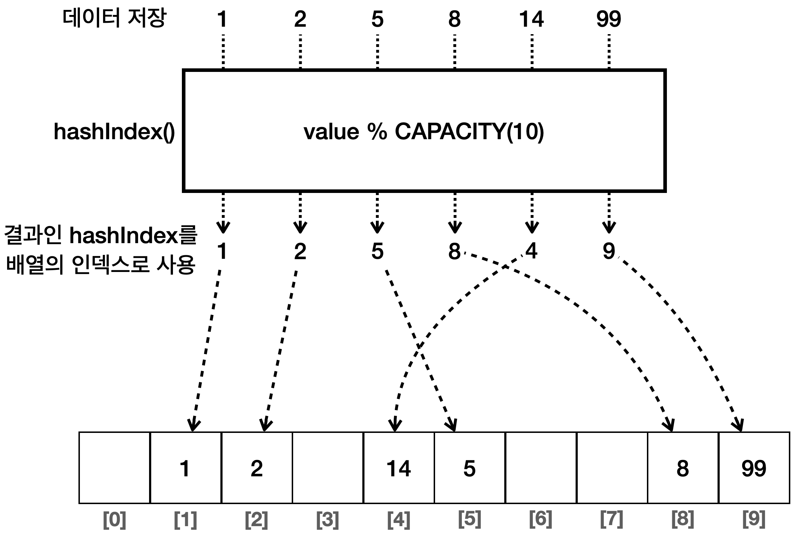
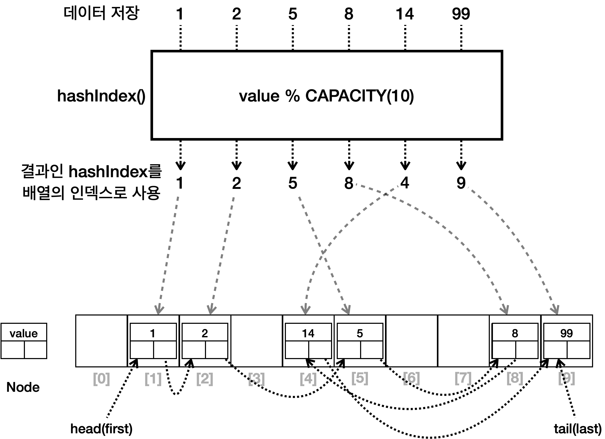
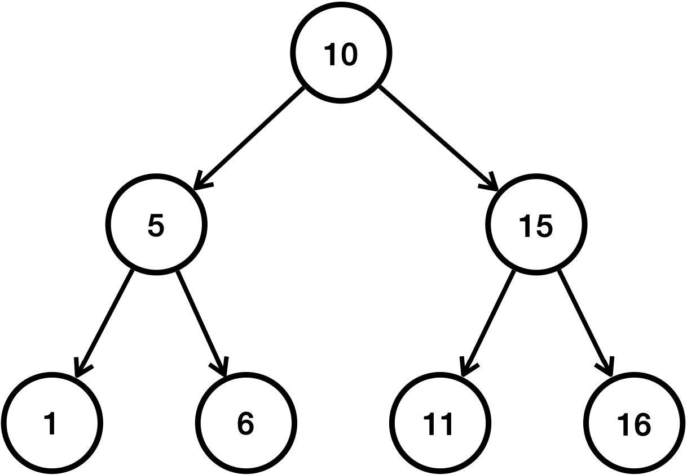
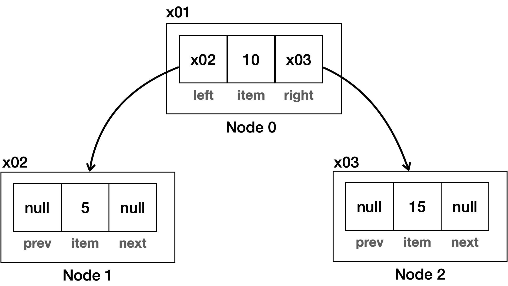
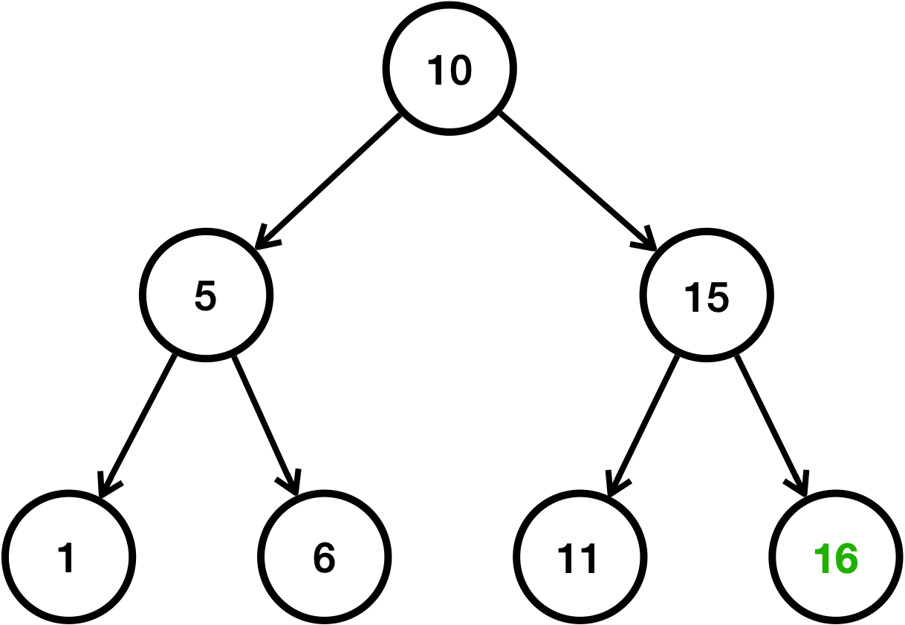
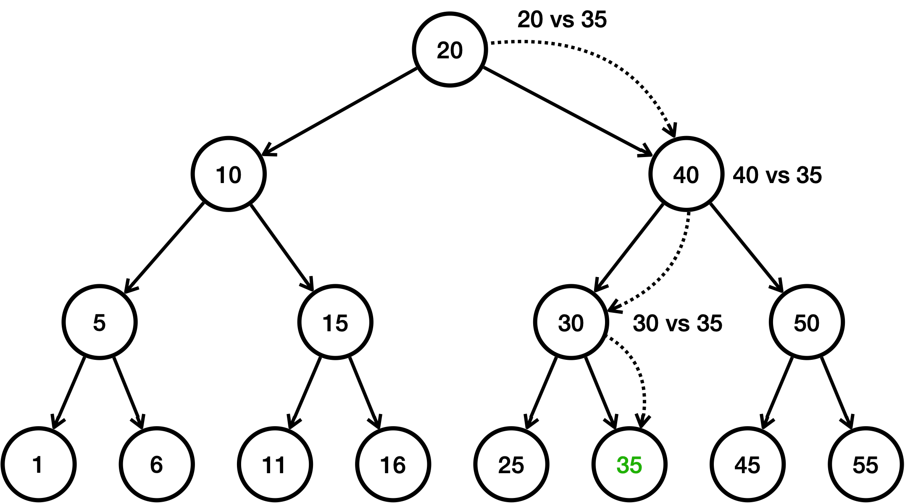

# 자바가 제공하는 Set

- 셋은 중복을 허용하지 않고, 순서를 보장하지 않는 자료 구조이다.


### Collection 인터페이스

- Collection` 인터페이스는 `java.util` 패키지의 컬렉션 프레임워크의 핵심 인터페이스 중 하나이다. 
- 이 인터페이스는 자바에서 다양한 컬렉션, 즉 데이터 그룹을 다루기 위한 메서드를 정의한다. 
- `Collection` 인터페이스는 `List` ,`Set` , `Queue` 와 같은 다양한 하위 인터페이스와 함께 사용되며, 이를 통해 데이터를 리스트, 세트, 큐 등의 형태로 관
  리할 수 있다.

### Set 인터페이스
- 자바의 `Set` 인터페이스는 `java.util` 패키지의 컬렉션 프레임워크에 속하는 인터페이스 중 하나이다. 
- `Set` 인터페이스는 중복을 허용하지 않는 유일한 요소의 집합을 나타낸다. 
- 즉, 어떤 요소도 같은 `Set` 내에 두 번 이상 나타날 수 없다. 
- `Set` 은 수학적 집합 개념을 구현한 것으로, 순서를 보장하지 않으며, 특정 요소가 집합에 있는지 여부를 확인하는데 최적화되어 있다.
- `Set` 인터페이스는 `HashSet` , `LinkedHashSet` , `TreeSet` 등의 여러 구현 클래스를 가지고 있으며, 각 클래스는
  `Set` 인터페이스를 구현하며 각각의 특성을 가지고 있다.

### Set 인터페이스의 주요 메서드
| 메서드 | 설명 |
| :--- | :--- |
| `add(E e)` | 지정된 요소를 세트에 추가한다 (이미 존재하는 경우 추가하지 않음). |
| `addAll(Collection<? extends E> c)` | 지정된 컬렉션의 모든 요소를 세트에 추가한다. |
| `contains(Object o)` | 세트가 지정된 요소를 포함하고 있는지 여부를 반환한다. |
| `containsAll(Collection<?> c)` | 세트가 지정된 컬렉션의 모든 요소를 포함하고 있는지 여부를 반환한다. |
| `remove(Object o)` | 지정된 요소를 세트에서 제거한다. |
| `removeAll(Collection<?> c)` | 지정된 컬렉션에 포함된 요소를 세트에서 모두 제거한다. |
| `retainAll(Collection<?> c)` | 지정된 컬렉션에 포함된 요소만을 유지하고 나머지 요소는 세트에서 제거한다. |
| `clear()` | 세트에서 모든 요소를 제거한다. |
| `size()` | 세트에 있는 요소의 수를 반환한다. |
| `isEmpty()` | 세트가 비어 있는지 여부를 반환한다. |
| `iterator()` | 세트의 요소에 대한 반복자를 반환한다. |
| `toArray()` | 세트의 모든 요소를 배열로 반환한다. |
| `toArray(T[] a)` | 세트의 모든 요소를 지정된 배열로 반환한다. |

### HashSet
- 해시 자료 구조를 사용하는 Set 인터페이스의 구현체
- 구현: 해시 자료 구조를 사용해서 요소를 저장한다.
- 순서: 요소들은 특정한 순서 없이 저장된다. 즉, 요소를 추가한 순서를 보장하지 않는다.
- 시간 복잡도: `HashSet` 의 주요 연산(추가, 삭제, 검색)은 평균적으로 `O(1)` 시간 복잡도를 가진다.
- 용도: 데이터의 유일성만 중요하고, 순서가 중요하지 않은 경우에 적합하다.
- hashCode()` , `equals()` 를 모두 사용한다.




### LinkedHashSet
- LinkedHashSet` 은 `HashSet` 에 연결 링크만 추가한 것이다.
- `HashSet` 에 `LinkedList` 를 합친 것으로 이해하면 된다.
- 이 연결 링크는 데이터를 입력한 순서대로 연결된다.
  - `head(first)` 부터 순서대로 링크를 따라가면 입력 순서대로 데이터를 순회할 수 있다.
  - 양방향으로 연결된다. (그림에서는 이해를 돕기 위해 화살표는 다음 순서로만 보여주었다. 실제로는 양방향
  이다.)
- 여기서는 1, 2, 5, 8, 14, 99 순서대로 입력된다. 링크를 보면 1, 2, 5, 8, 14, 99 순서로 연결 되어 있는 것을 확
인할 수 있다.
- 이 링크를 `first` 부터 순서대로 따라가면서 출력하면 순서대로 출력할 수 있다.
- set은 기본적으로 순서를 보장하지 않기 때문에 순서를 보장하고 싶다면 LinkedHashSet을 쓰면 된다.




### TreeSet
- 구현: `TreeSet` 은 이진 탐색 트리를 개선한 레드-블랙 트리를 내부에서 사용한다.
- 순서: 요소들은 정렬된 순서로 저장된다. 순서의 기준은 비교자( `Comparator` )로 변경할 수 있다. 비교자는 뒤에
  서 다룬다.
- 시간 복잡도: 주요 연산들은 `O(log n)` 의 시간 복잡도를 가진다. 따라서 `HashSet` 보다는 느리다.
- 용도: 데이터들을 정렬된 순서로 유지하면서 집합의 특성을 유지해야 할 때 사용한다. 예를 들어, 범위 검색이나
  정렬된 데이터가 필요한 경우에 유용하다. 참고로 입력된 순서가 아니라 데이터 값의 순서이다. 예를 들어 3, 1, 2
  를 순서대로 입력해도 1, 2, 3 순서로 출력된다.
### 트리 구조
- TreeSet을 이해하려면 먼저 트리 구조에 대해서 알아야 한다.



- 트리는 부모 노드와 자식 노드로 구성된다.
- 가장 높은 조상을 루트(root)라 한다. 
- 이 그림을 뒤집어보면 왜 트리라고 하는지, 처음을 루트라고 하는지 이해가
될 것이다.

- 자식이 2개까지 올 수 있는 트리를 **이진 트리**라 한다.

- 여기에 노드의 왼쪽 자손은 더 작은 값을 가지고, 오른쪽 자손은 더 큰 값을 가지는 것을 **이진 탐색 트리**라 한다.
- `TreeSet` 은 이진 탐색 트리를 개선한 레드-블랙 트리를 사용한다. 기본 개념은 비슷하므로 이진 탐색 트리의 원
리를 알아보자.

### 트리 구조 구현


- 트리 구조는 왼쪽, 오른쪽 노드를 알고 있으면 된다.
  앞서 다룬 연결 리스트의 구현을 떠올려보면 쉽게 이해가 될 것이다.

### 이진 탐색 트리 
- 이진 탐색 트리의 핵심은 데이터를 입력하는 시점에 정렬해서 보관한다는 점이다.
- 그리고 작은 값은 왼쪽에 큰 값은 오른쪽에 저장하면 된다.
- 데이터를 10, 5, 15, 1, 6, 11, 16 순서대로 입력한다고 가정해보자.


- 처음에 10을 입력했다고 가정하자. 다음으로 5, 15를 입력한다.
- 5는 10보다 작으므로 왼쪽에 저장된다.
- 15는 10보다 크므로 오른쪽에 저장된다.
- 1은 10보다 작다. 따라서 왼쪽으로 찾아간다. 1은 5보다 작다 따라서 왼쪽에 저장된다.
- 6은 10보다 작다. 따라서 왼쪽으로 찾아간다. 6은 5보다 크다. 따라서 오른쪽에 저장된다.
- 11은 10보다 크다. 따라서 오른쪽으로 찾아간다. 11은 15보다 작다. 따라서 왼쪽에 저장된다.
- 16은 10보다 크다. 따라서 오른쪽으로 찾아간다. 16은 15보다 크다. 따라서 오른쪽에 저장된다.

### 이진 탐색 트리 검색



- 여기에는 총 15개의 데이터가 들어있다. 여기서 숫자 35를 검색한다고 가정해보자.
- 1번: 루트인 20과 35를 비교한다. 35가 더 크므로 오른쪽으로 찾아간다.
- 2번: 40과 35를 비교한다. 35가 더 작으므로 왼쪽으로 찾아간다.
- 3번: 30과 35를 비교한다. 35가 더 크므로 오른쪽으로 찾아간다.
- 4번: 노드에 있는 값을 비교한다. 35와 같으므로 35를 찾는다.
- 데이터가 총 15개인데 4번의 계산으로 필요한 결과를 얻을 수 있었다. 이것은 `O(n)` 인 리스트의 검색보다는 빠르고,
  O(1)인 해시의 검색 보다는 느리다.
- 이진 탐색 트리 계산의 핵심은 한번에 절반을 날린 다는 점이다.
- 따라서 시간 복잡도가 log n 이 나온다.

### 이진 탐색 트리 순회
- 이진 탐색 트리의 핵심은 입력 순서가 아니라, 데이터의 값을 기준으로 정렬해서 보관한다는 점이다.
- 따라서 정렬된 순서로 데이터를 차례로 조회할 수 있다. (순회 할 수 있다.)
- 데이터를 차례로 순회하려면 중위 순회라는 방법을 사용하면 된다. 
- 왼쪽 서브트리를 방문한 다음, 현재 노드를 처리하고, 마지막으로 오른쪽 서브트리를 방문한다. 
- 이 방식은 이진 탐색 트리의 특성상, 노드를 오름차순(숫자가 점
  점 커짐)으로 방문한다.

### 자바가 제공하는 Set 사용 예제

```java
public class JavaSetMain {

    public static void main(String[] args) {
        run(new HashSet<>());
        run(new LinkedHashSet<>());
        run(new TreeSet<>());
    }

    private static void run(Set<String> set) {
        System.out.println("set = " + set.getClass());
        set.add("C");
        set.add("B");
        set.add("A");
        set.add("1");
        set.add("2");

        Iterator<String> iterator = set.iterator();
        while (iterator.hasNext()) {
            System.out.print(iterator.next() + " ");
        }
        System.out.println();
    }
}

// 출력 결과
set = class java.util.HashSet
A 1 B 2 C // HashSet : 입력한 순서를 보장하지 않는다.
set = class java.util.LinkedHashSet
C B A 1 2 // LinkedHashSet : 입력한 순서를 정확히 보장한다.
set = class java.util.TreeSet
1 2 A B C  // TreeSet : 데이터 값을 기준으로 정렬한다.
```

### 자바 HashSet의 최적화
- 해시 기반 자료 구조를 사용하는 경우 통계적으로 입력한 데이터의 수가 배열의 크기를 75% 정도 넘어가면 해시
  인덱스가 자주 충돌한다. 
- 해시 충돌로 같은 해시 인덱스에 들어간 데이터를 검색하려면 모두 탐색 해야 한다.
- 따라서 75%가 넘어가면 성능이 떨어지기 시작한다.
- 하지만 데이터가 동적으로 계속 추가되기 때문에 적절한 배열의 크기를 정하는 것은 어렵다.
- 자바의 `HashSet` 은 데이터의 양이 배열 크기의 75%를 넘어가면 배열의 크기를 2배로 늘리고 2배 늘어난 크기를 기준으로 모든 요소에 해시 인덱스를 다시 적용한다. 이 과정을 재해싱(rehashing)이라 한다.
- 해시 인덱스를 다시 적용하는 시간이 걸리지만, 결과적으로 해시 충돌이 줄어든다.
  자바 `HashSet` 의 기본 크기는 `16` 이다.

### 정리
- 실무에서는 `Set` 이 필요한 경우 `HashSet` 을 가장 많이 사용한다. 그리고 입력 순서 유지, 값 정렬의 필요에 따라서
  `LinkedHashSet` , `TreeSet` 을 선택하면 된다.